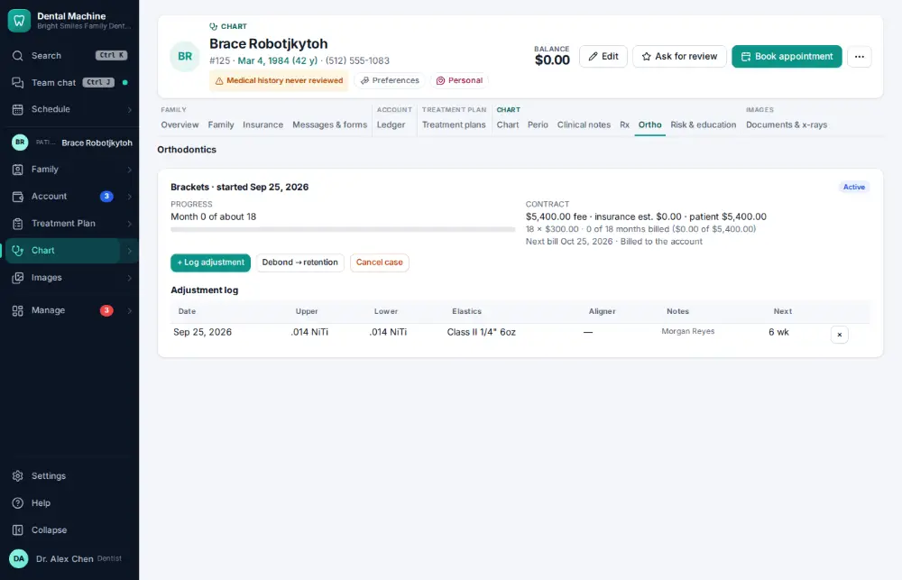
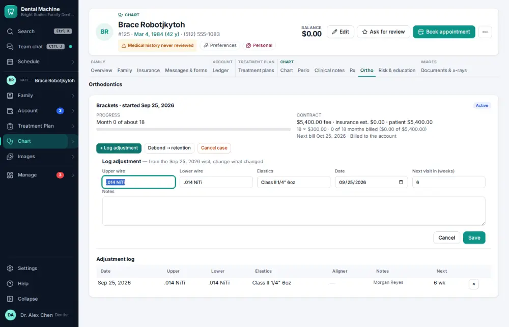
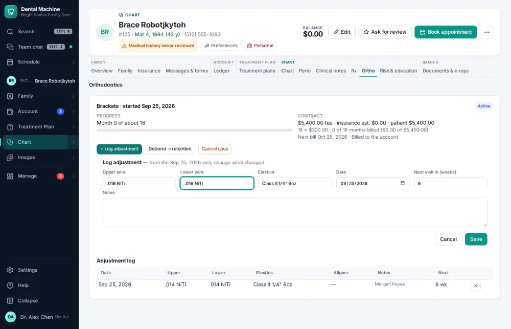
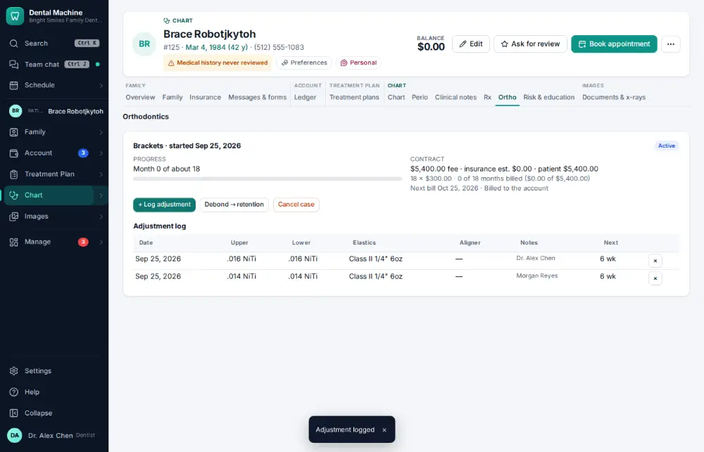

# How do I record an orthodontic adjustment visit?

**Who:** dentist · **Where:** Chart ▾ → Ortho tab → + Log adjustment · **How often:** Every day

Log an orthodontic adjustment: the last visit’s wires and elastics are filled in, so you only type what changed.

## Where to start

## Steps

1. Ortho tab: click "+ Log adjustment" — the last visit’s wires and elastics are filled in, the cursor in the upper wire

   

2. Type the new upper wire, Tab, the new lower wire (the elastics stay)  
   Keys: <kbd>Tab</kbd>

   

3. Press Enter: logged  
   Keys: <kbd>Enter</kbd>

   

## Related

- [How do I write a clinical note?](A011-write-a-clinical-note.md)
- [How do I refer a patient to a specialist?](A089-refer-a-patient-to-a-specialist.md)
- [How do I print a treatment plan?](A096-print-a-treatment-plan.md)
- [How do I write a prescription?](A062-write-a-prescription.md)
- [How do I record a caries risk assessment?](A068-record-a-caries-risk-assessment.md)

---
[All how-tos](README.md) · Action A101 · screenshots from the robot run of 2026-09-25
