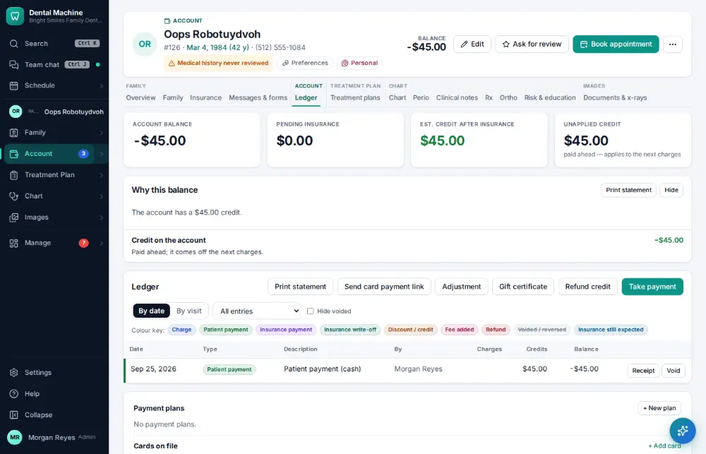
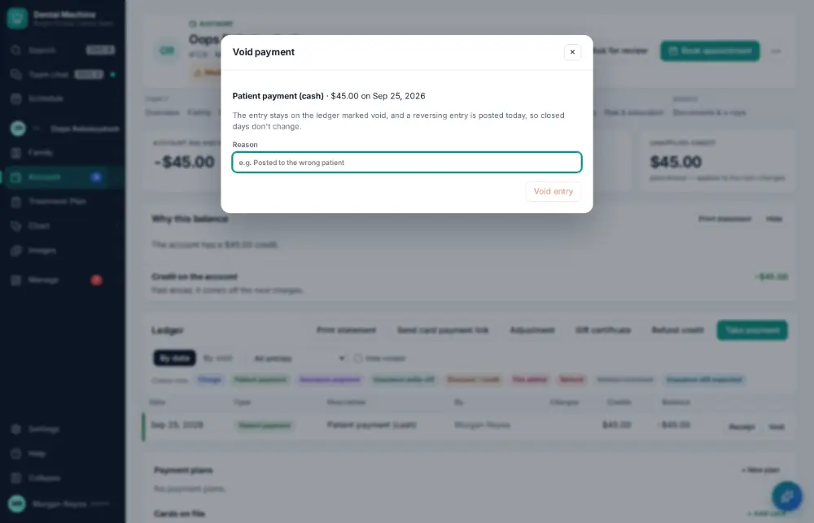
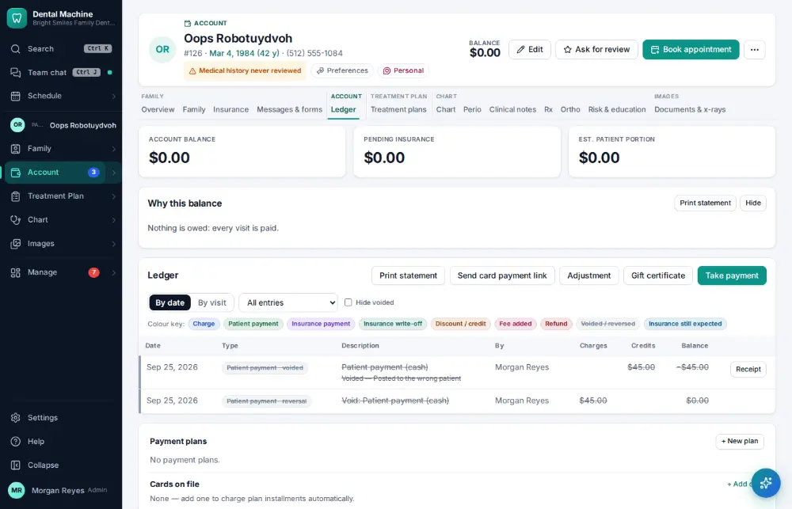

# How do I void a payment posted by mistake?

**Who:** front desk, billing · **Where:** Ledger → the payment’s line → Void · **How often:** About weekly

A payment posted by mistake is voided with a reason, not deleted: the original stays on the ledger with a reversing line, so the history is complete.

## Where to start

## Steps

1. Ledger: click "Void" on the payment’s line

   

2. Type the reason and click "Void entry": reversed (the original stays on the ledger)

   

## Tips

- Voiding needs billing permission and is recorded in the audit log.
- To give money back to the patient, use a refund instead ([A110](A110-refund-a-credit-balance.md)).

## If something goes wrong

- **“Voiding charges over $… needs an administrator”** — Ask an administrator to do it.
- **“Missing permission: …”** — Your role can’t void — ask the office manager.
- **The payment is already on a deposit** — A manager may need to reopen that deposit first ([A084](A084-make-the-daily-bank-deposit.md)).

## Related

- [How do I take a patient payment?](A019-take-a-patient-payment.md)
- [How do I refund a credit balance?](A110-refund-a-credit-balance.md)
- [How do I post an adjustment or write-off?](A064-post-an-adjustment-or-write-off.md)
- [How do I make the daily bank deposit?](A084-make-the-daily-bank-deposit.md)
- [How do I count the cash drawer?](A086-count-the-cash-drawer.md)

---
[All how-tos](README.md) · Action A102 · screenshots from the robot run of 2026-09-25
