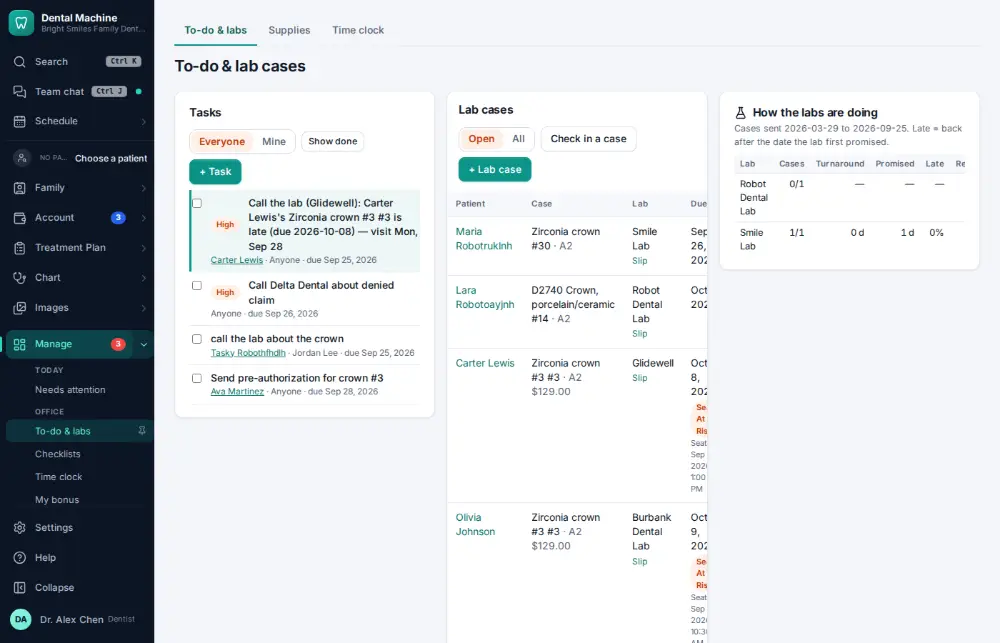

# How do I look up remaining lab cases / what is overdue?

**Who:** assistant · **Where:** Manage ▾ → To-do & labs · **How often:** About weekly

To-do & labs lists every open lab case with its due date, flagged “at risk” when it may not be back for the visit.

## Steps

1. In the menu open Manage ▾ and click "To-do & labs": open lab cases with due dates and "at risk" flags

   

## Related

- [How do I create a lab case?](A073-create-a-lab-case.md)
- [How do I check in a case back from the lab?](A074-check-in-a-case-back-from-the-lab.md)
- [How do I order supplies that are running low?](A111-order-supplies-that-are-running-low.md)
- [How do I receive a supply delivery?](A112-receive-a-supply-delivery.md)

---
[All how-tos](README.md) · Action A103 · screenshots from the robot run of 2026-09-25
