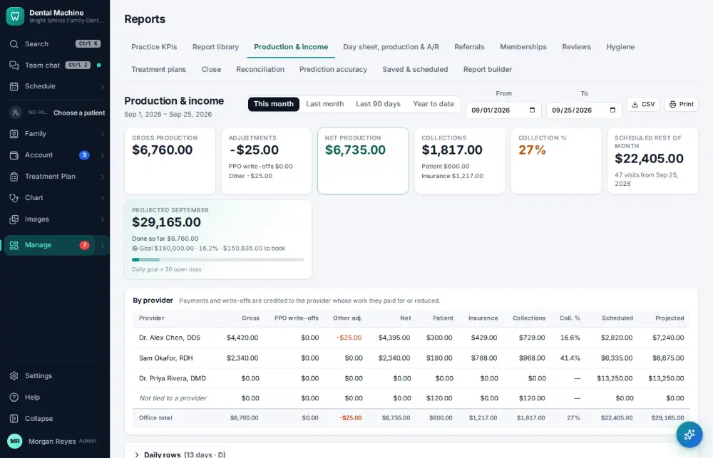

# How do I look at the production & collections report?

**Who:** office manager · **Where:** Manage ▾ → Reports → Production & income · **How often:** About weekly

Production and collections by provider for any period.

## Steps

1. Press Ctrl/⌘K, type "production & income", Enter: production and collections by provider  
   Keys: <kbd>Ctrl/⌘ K</kbd> type “production & income” <kbd>Enter</kbd>

   

## Tips

- On the report: D shows or hides the daily rows, E exports a spreadsheet, P prints.

## Related

- [How do I check the day sheet at the end of the day?](A085-check-the-day-sheet-at-the-end-of-the-day.md)
- [How do I check practice KPIs and metrics?](A105-check-practice-kpis-and-metrics.md)
- [How do I close the month?](A146-close-the-month.md)
- [How do I review insurance A/R aging?](A124-review-insurance-a-r-aging.md)
- [How do I review phone results?](A128-review-phone-results.md)

---
[All how-tos](README.md) · Action A104 · screenshots from the robot run of 2026-09-25
