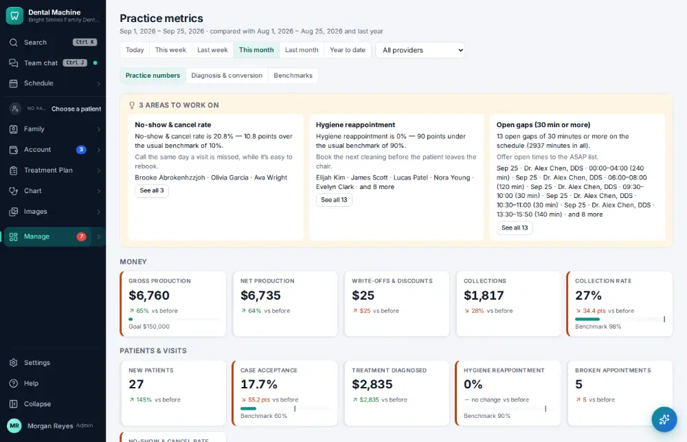

# How do I check practice KPIs and metrics?

**Who:** office manager · **Where:** Manage ▾ → Metrics · **How often:** About weekly

The practice’s key numbers (KPIs) in one place.

## Steps

1. Press Ctrl/⌘K, type "metrics", Enter: the practice KPIs  
   Keys: <kbd>Ctrl/⌘ K</kbd> type “metrics” <kbd>Enter</kbd>

   

## Related

- [How do I look at the production & collections report?](A104-look-at-the-production-collections-report.md)
- [How do I see what pays?](A137-see-what-pays.md)
- [How do I review schedule capacity?](A129-review-schedule-capacity.md)
- [How do I check the day sheet at the end of the day?](A085-check-the-day-sheet-at-the-end-of-the-day.md)
- [How do I review insurance A/R aging?](A124-review-insurance-a-r-aging.md)

---
[All how-tos](README.md) · Action A105 · screenshots from the robot run of 2026-09-25
