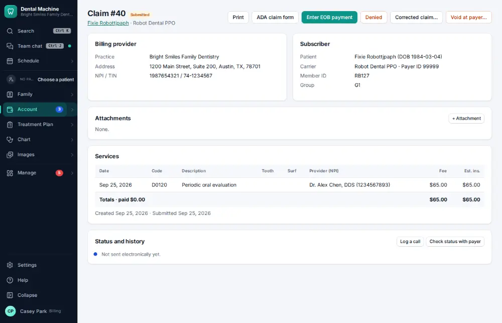
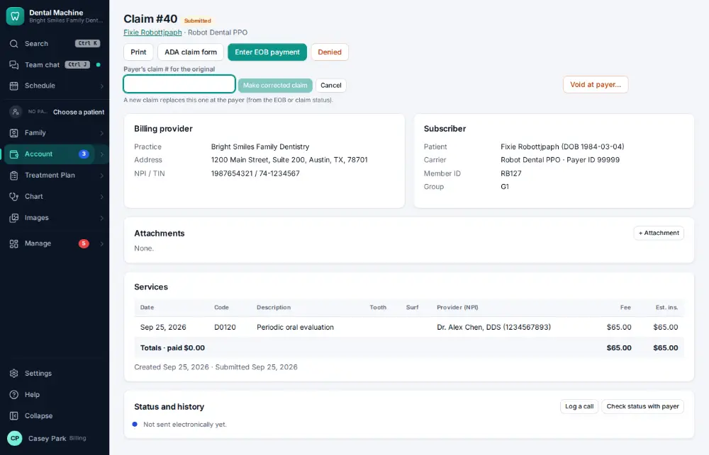
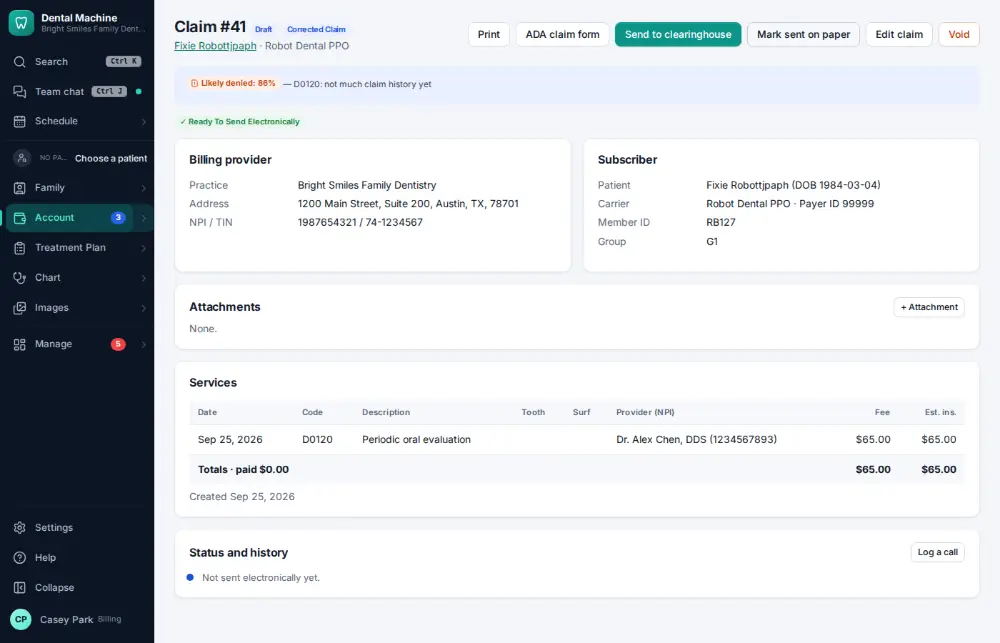

# How do I resend or fix a rejected claim?

**Who:** billing · **Where:** The claim → Corrected claim… · **How often:** About weekly

For a claim the payer already processed, send a corrected claim: type the payer’s claim number for the original and the corrected claim opens, ready to fix and send.

## Where to start

## Steps

1. On the claim, click "Corrected claim…": a box for the payer’s claim number opens right there

   

2. Type the payer’s claim number and press Enter: the corrected claim opens, ready to send  
   Keys: <kbd>Enter</kbd>

   

## Tips

- A claim the clearinghouse rejected before the payer saw it can simply be fixed and sent again.

## If something goes wrong

- **“The claim changed — reload and try again”** — Someone else changed it at the same time; reload the page.

## Related

- [How do I void or correct a claim?](A114-void-or-correct-a-claim.md)
- [How do I appeal a denied claim?](A109-appeal-a-denied-claim.md)
- [How do I look up a claim's status?](A067-look-up-a-claim-s-status.md)
- [How do I review tomorrow's insurance verification list?](A087-review-tomorrow-s-insurance-verification-list.md)
- [How do I add a secondary insurance policy?](A091-add-a-secondary-insurance-policy.md)

---
[All how-tos](README.md) · Action A106 · screenshots from the robot run of 2026-09-25
