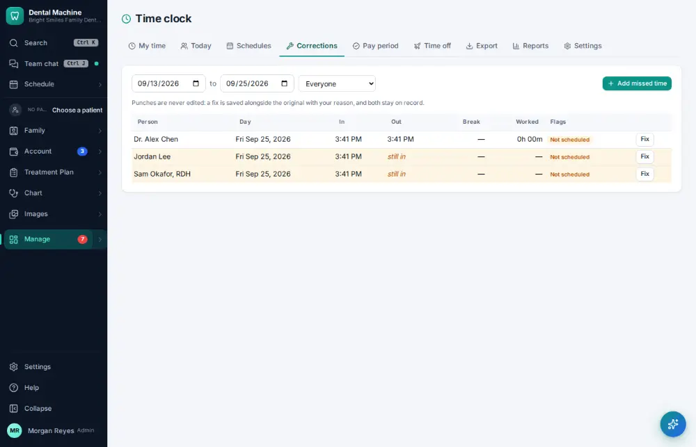
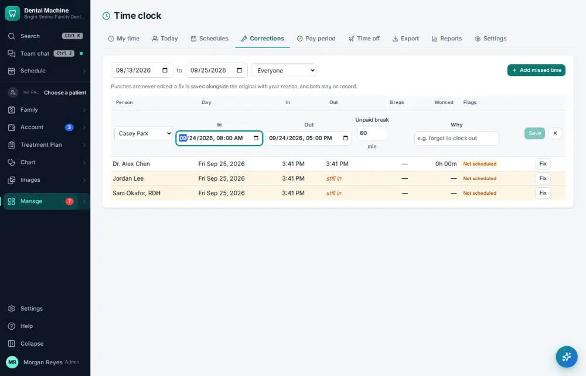
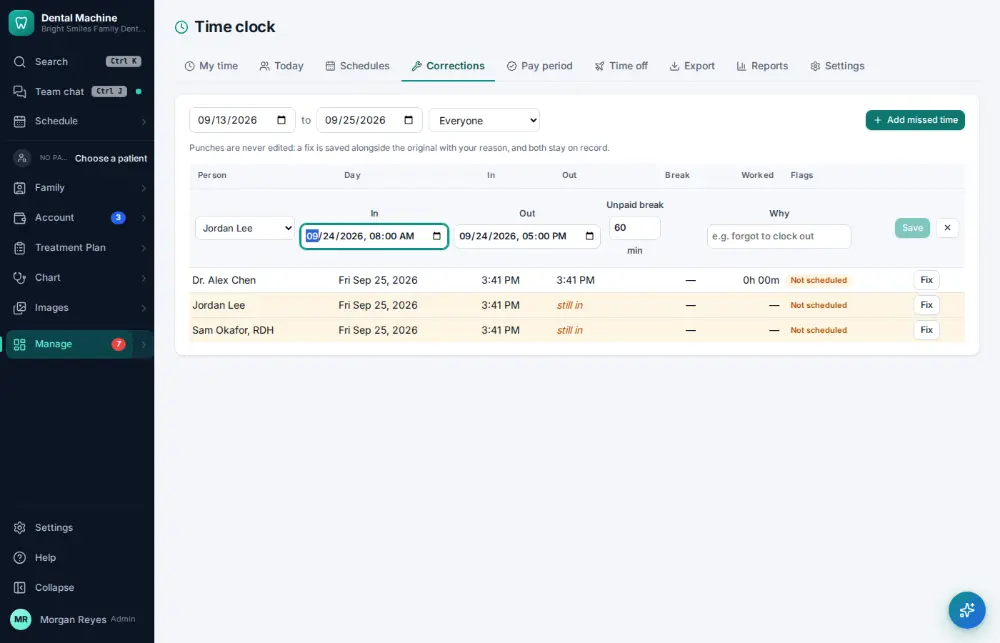
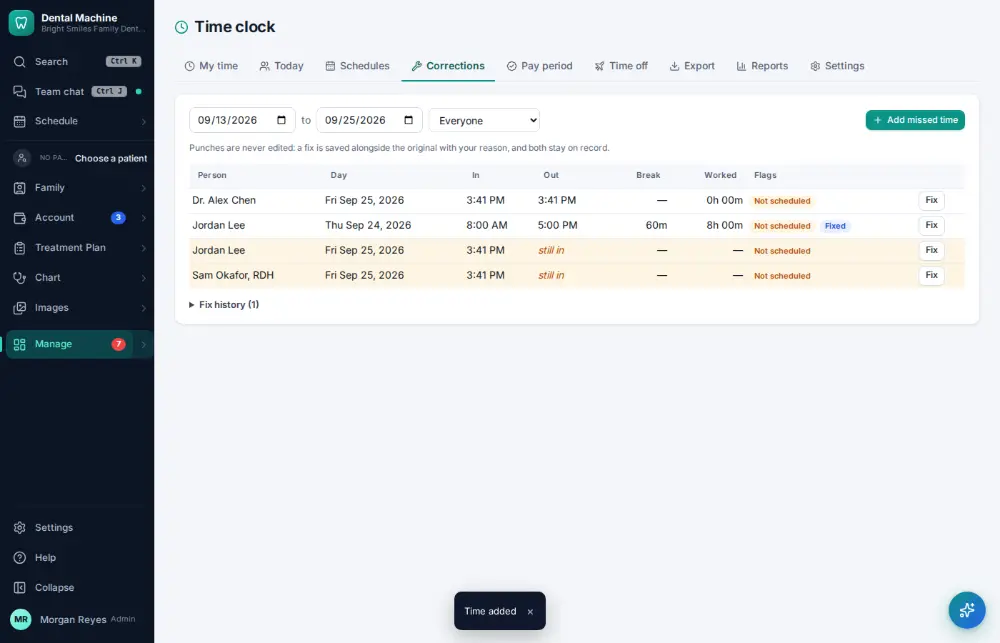

# How do I fix a missed time-clock punch?

**Who:** office manager · **Where:** Manage ▾ → Time clock → Corrections · **How often:** About weekly

Add the time someone forgot to punch. A row for the last workday (8:00–5:00, 60 minute break) is ready; pick the person and say why. The original punches are kept.

## Where to start

## Steps

1. Time clock → Corrections: click "Add missed time" (a row for the last workday, 8:00–5:00, 60 min break)

   

2. Pick the person who forgot

   

3. Type why and click Save: saved beside the original, both kept on record

   

## If something goes wrong

- **“Clock-out must be after clock-in”** — Check the times.
- **“Clock-in can’t be in the future”** — Pick the right day.

## Related

- [How do I approve payroll hours?](A122-approve-payroll-hours.md)
- [How do I clock in?](A059-clock-in.md)
- [How do I clock out?](A060-clock-out.md)
- [How do I edit staff work schedules?](A123-edit-staff-work-schedules.md)
- [How do I check my bonus?](A131-check-my-bonus.md)

---
[All how-tos](README.md) · Action A107 · screenshots from the robot run of 2026-09-25
