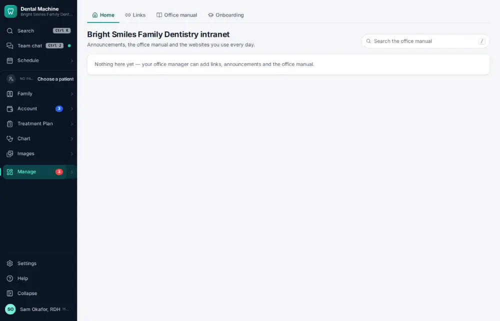

# How do I read the office manual?

**Who:** everyone · **Where:** Manage ▾ → Intranet · **How often:** About weekly

The intranet is the office’s own manual: policies, how-tos and links, plus announcements.

## Steps

1. Press Ctrl/⌘K, type "intranet", Enter: the office manual opens  
   Keys: <kbd>Ctrl/⌘ K</kbd> type “intranet” <kbd>Enter</kbd>

   

## Tips

- Managers press N for a new page, E to edit one; L lists all office links.

## Related

- [How do I post an announcement for the team?](A135-post-an-announcement-for-the-team.md)
- [How do I run the morning huddle?](A083-run-the-morning-huddle.md)
- [How do I complete the opening or closing checklist?](A079-complete-the-opening-or-closing-checklist.md)
- [How do I work the Needs attention list?](A049-work-the-needs-attention-list.md)
- [How do I mark a task done?](A034-mark-a-task-done.md)

---
[All how-tos](README.md) · Action A108 · screenshots from the robot run of 2026-09-25
