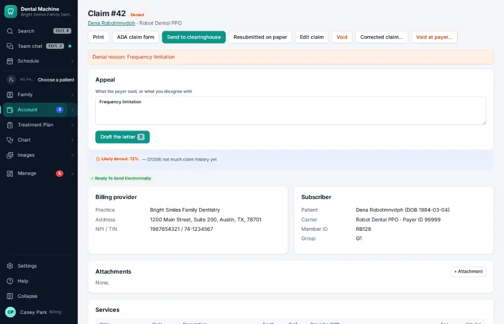
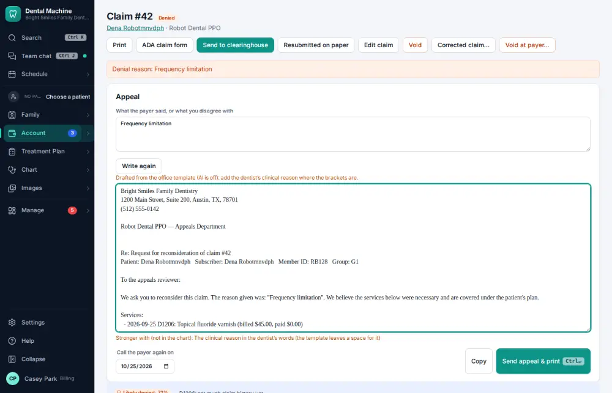
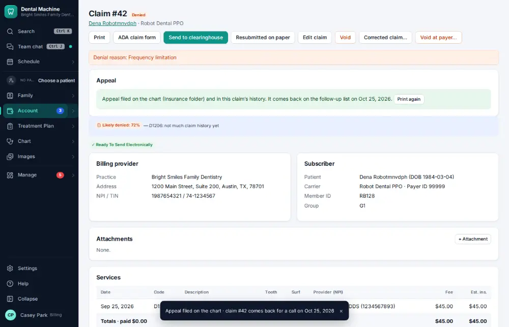

# How do I appeal a denied claim?

**Who:** billing · **Where:** The denied claim · **How often:** About weekly

D on a denied claim drafts an appeal letter from the chart; Ctrl/⌘ Enter files it on the chart, prints it and sets a follow-up in 30 days.

## Where to start

## Steps

1. On the denied claim, press D: an appeal letter is drafted  
   Keys: <kbd>D</kbd>

   

2. Press Ctrl/⌘+Enter: filed on the chart, follow-up set in 30 days  
   Keys: <kbd>Ctrl/⌘ Enter</kbd>

   

## Tips

- Read the draft and change anything before sending; the AI only drafts.

## Related

- [How do I resend or fix a rejected claim?](A106-resend-or-fix-a-rejected-claim.md)
- [How do I call an insurance company about an unpaid claim?](A075-call-an-insurance-company-about-an-unpaid-claim.md)
- [How do I void or correct a claim?](A114-void-or-correct-a-claim.md)
- [How do I review tomorrow's insurance verification list?](A087-review-tomorrow-s-insurance-verification-list.md)
- [How do I add a secondary insurance policy?](A091-add-a-secondary-insurance-policy.md)

---
[All how-tos](README.md) · Action A109 · screenshots from the robot run of 2026-09-25
