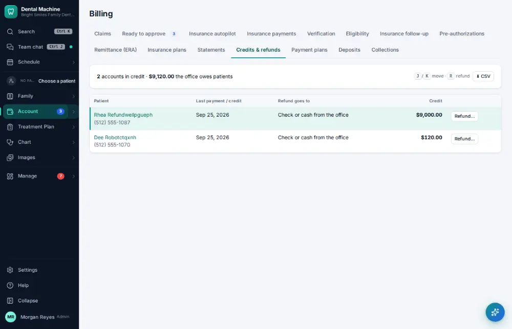
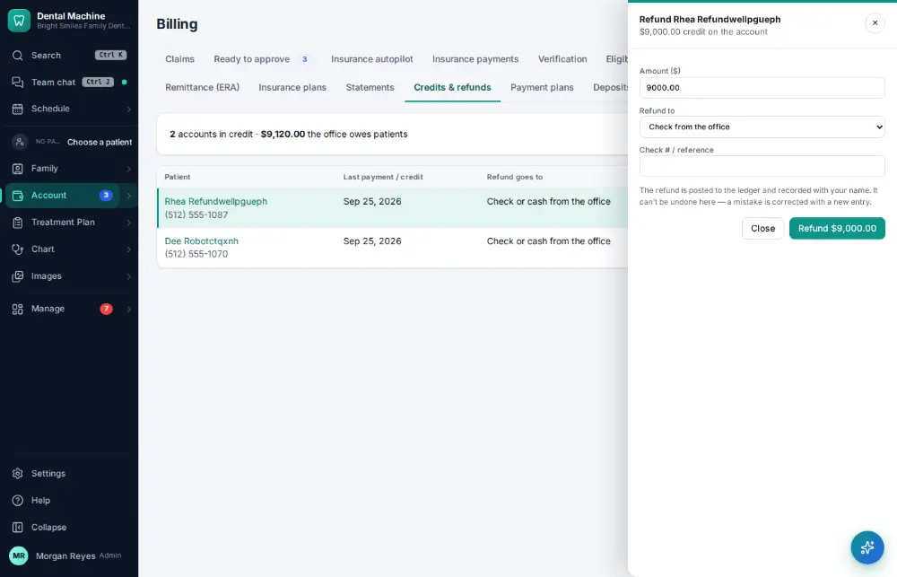
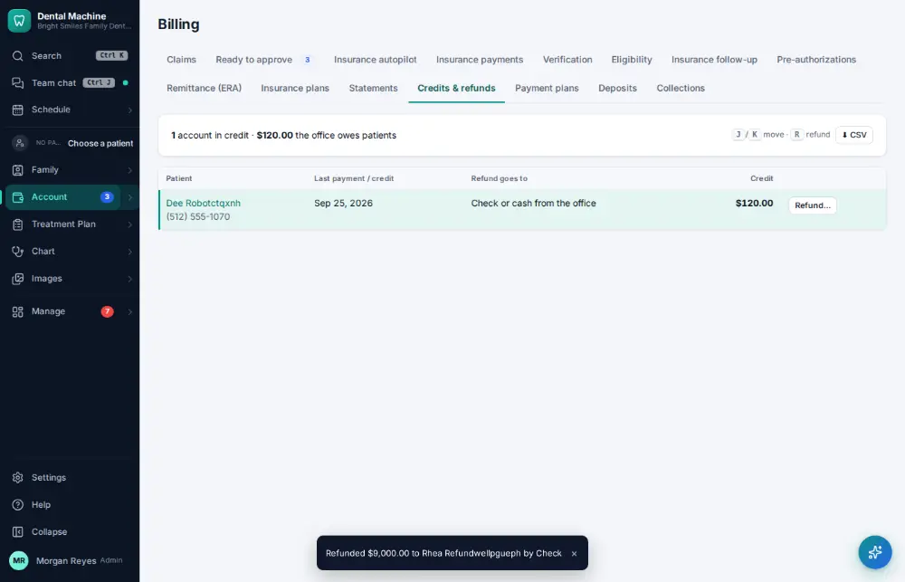

# How do I refund a credit balance?

**Who:** billing · **Where:** Account ▾ → Billing & claims → Credits & refunds · **How often:** About weekly

Credits & refunds lists accounts with a credit. R prepares the refund with the amount and the card filled in; Enter sends it. Money going out has no Undo, and it is audited.

## Where to start

## Steps

1. Billing → Credits & refunds: the credit is highlighted. Press R: the refund is ready, amount and card filled in  
   Keys: <kbd>R</kbd>

   

2. Press Enter: refunded (audited; money out has no Undo)  
   Keys: <kbd>Enter</kbd>

   

## Tips

- Staff who can’t refund can press R to ask a manager instead.

## If something goes wrong

- **“A refund needs a manager — ask one to do it”** — Only managers refund.
- **“Only $… of that payment is left to refund”** — Part of it was refunded already.

## Related

- [How do I void a payment posted by mistake?](A102-void-a-payment-posted-by-mistake.md)
- [How do I take a patient payment?](A019-take-a-patient-payment.md)
- [How do I set up a payment plan?](A113-set-up-a-payment-plan.md)
- [How do I sign a patient up for the membership plan?](A118-sign-a-patient-up-for-the-membership-plan.md)
- [How do I send patient statements?](A119-send-patient-statements.md)

---
[All how-tos](README.md) · Action A110 · screenshots from the robot run of 2026-09-25
