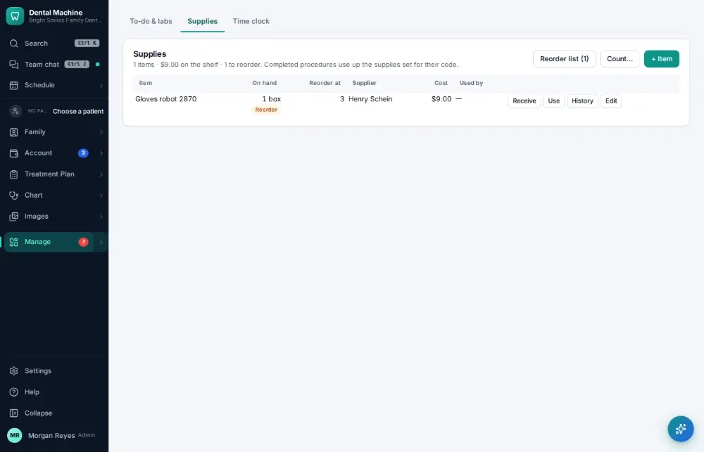
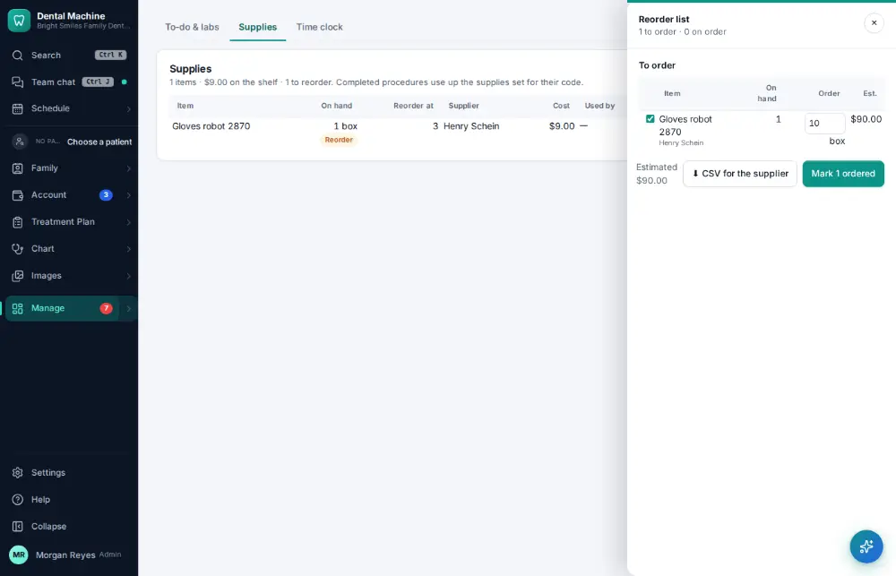
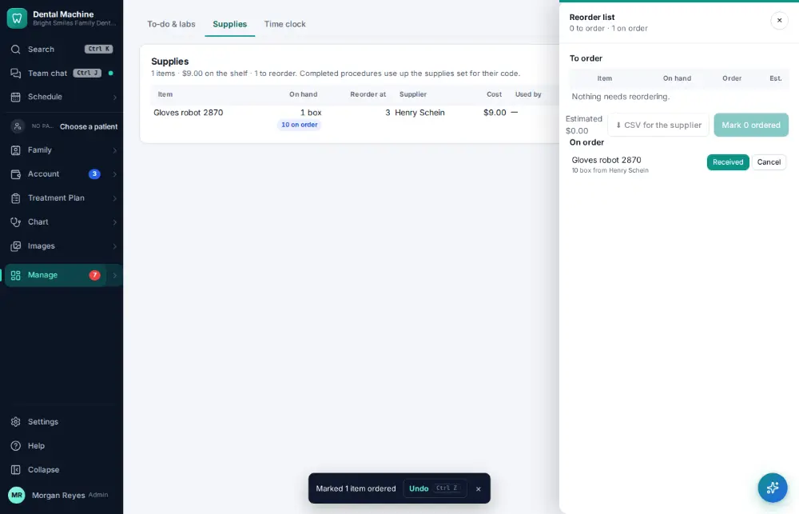

# How do I order supplies that are running low?

**Who:** office manager, assistant · **Where:** Manage ▾ → To-do & labs → Supplies · **How often:** About weekly

O on Supplies shows the reorder list — what is running low — with “Mark … ordered” ready.

## Where to start

## Steps

1. Supplies: press O — the reorder list with what’s low, "Mark … ordered" focused  
   Keys: <kbd>O</kbd>

   

2. Press Enter: marked ordered (Undo shows)  
   Keys: <kbd>Enter</kbd>

   

## Tips

- Undo on the notice takes it back.

## Related

- [How do I receive a supply delivery?](A112-receive-a-supply-delivery.md)
- [How do I look up remaining lab cases / what is overdue?](A103-look-up-remaining-lab-cases-what-is-overdue.md)
- [How do I create a lab case?](A073-create-a-lab-case.md)
- [How do I check in a case back from the lab?](A074-check-in-a-case-back-from-the-lab.md)

---
[All how-tos](README.md) · Action A111 · screenshots from the robot run of 2026-09-25
