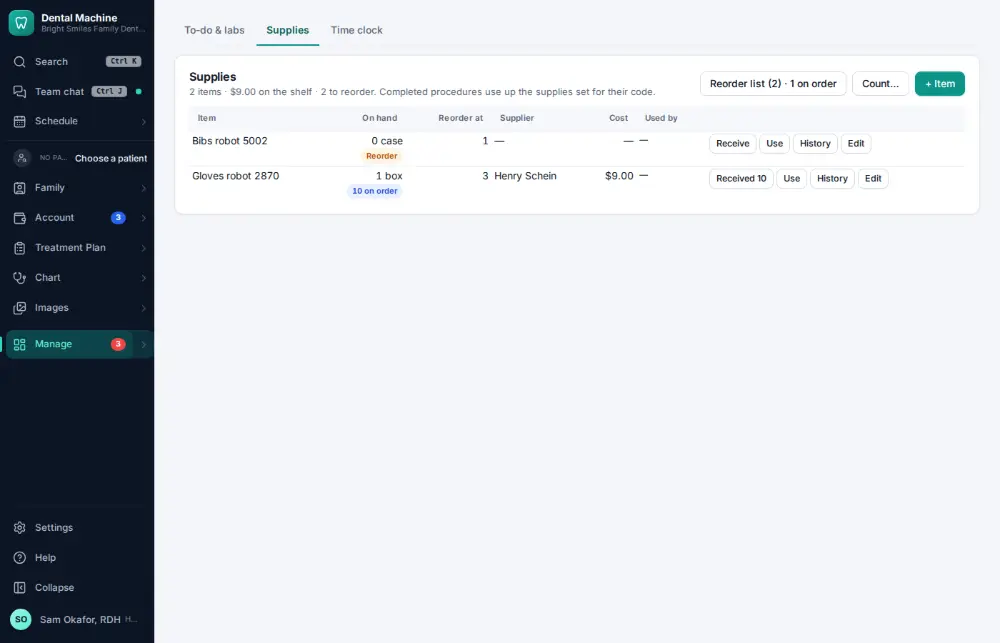
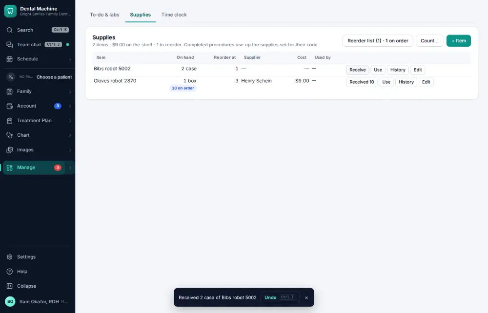

# How do I receive a supply delivery?

**Who:** assistant · **Where:** Manage ▾ → To-do & labs → Supplies · **How often:** About weekly

When an order arrives, mark it received and the stock count goes up.

## Where to start

## Steps

1. Click "Received" on the item: stock updated (Undo shows)

   

## Related

- [How do I order supplies that are running low?](A111-order-supplies-that-are-running-low.md)
- [How do I look up remaining lab cases / what is overdue?](A103-look-up-remaining-lab-cases-what-is-overdue.md)
- [How do I create a lab case?](A073-create-a-lab-case.md)
- [How do I check in a case back from the lab?](A074-check-in-a-case-back-from-the-lab.md)

---
[All how-tos](README.md) · Action A112 · screenshots from the robot run of 2026-09-25
