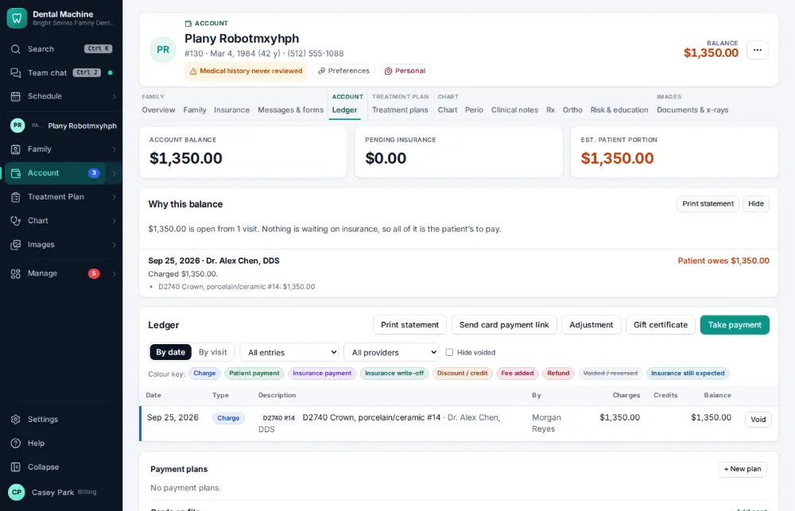
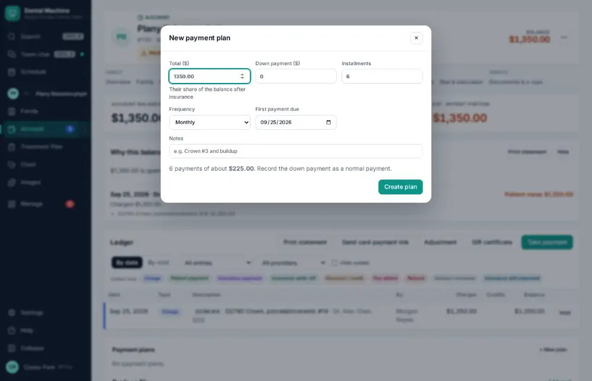
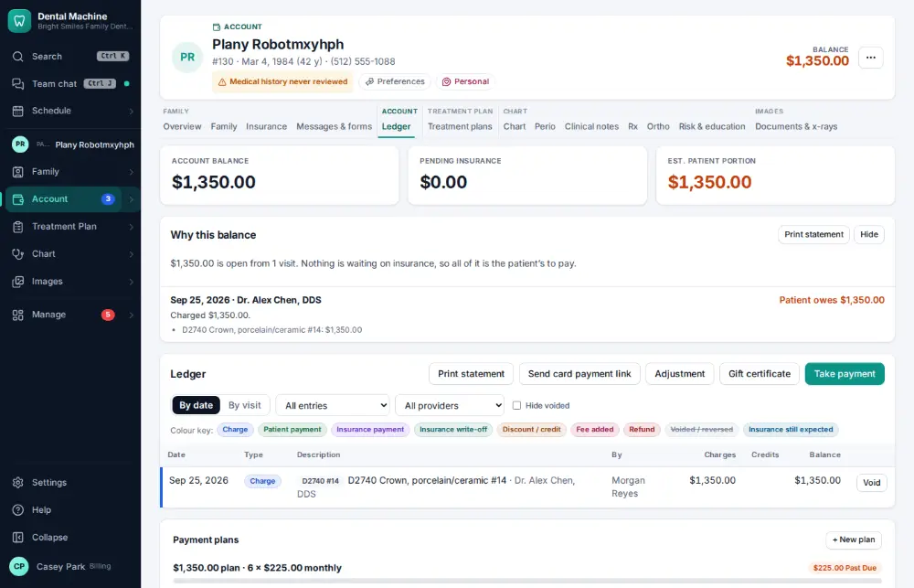

# How do I set up a payment plan?

**Who:** billing · **Where:** Ledger → Payment plans → + New plan · **How often:** About weekly

Split a balance into monthly installments (6 by default).

## Where to start

## Steps

1. Ledger → Payment plans: click "+ New plan": a dialog with 6 monthly installments

   

2. Click "Create plan"

   

## If something goes wrong

- **“Choose a card on file for this plan first”** — Automatic charges need a saved card.

## Related

- [How do I send a financing application?](A088-send-a-financing-application.md)
- [How do I take a patient payment?](A019-take-a-patient-payment.md)
- [How do I refund a credit balance?](A110-refund-a-credit-balance.md)
- [How do I sign a patient up for the membership plan?](A118-sign-a-patient-up-for-the-membership-plan.md)
- [How do I send patient statements?](A119-send-patient-statements.md)

---
[All how-tos](README.md) · Action A113 · screenshots from the robot run of 2026-09-25
