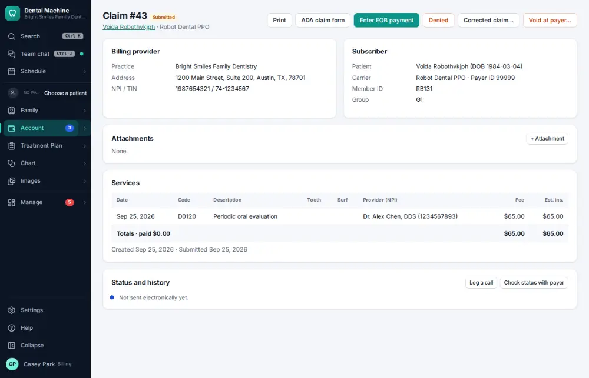
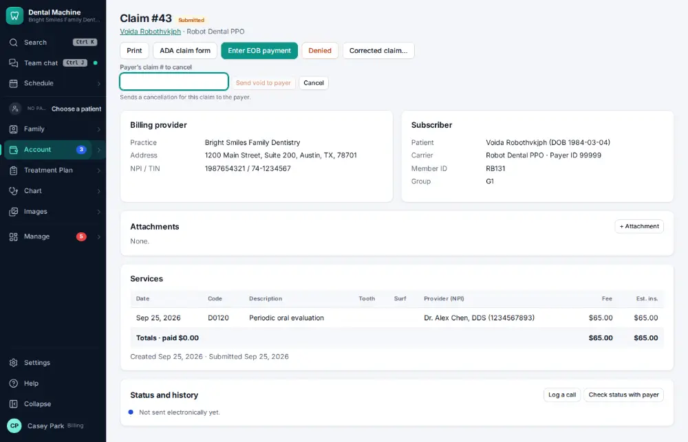
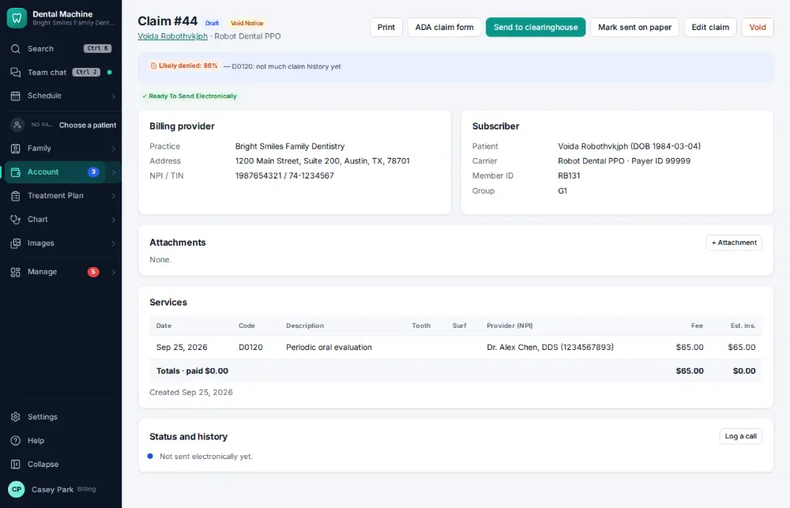

# How do I void or correct a claim?

**Who:** billing · **Where:** The claim → Void at payer… · **How often:** About weekly

Cancel a claim the payer already has: type the payer’s claim number from the EOB and the void notice is made. The claim is voided, never deleted.

## Where to start

## Steps

1. On the claim, click "Void at payer…": a box for the payer’s claim number opens right there

   

2. Type the payer’s claim number from the EOB and press Enter: the void notice is made  
   Keys: <kbd>Enter</kbd>

   

## If something goes wrong

- **“Cannot void a claim that is …”** — Some statuses can’t be voided; send a corrected claim instead ([A106](A106-resend-or-fix-a-rejected-claim.md)).

## Related

- [How do I resend or fix a rejected claim?](A106-resend-or-fix-a-rejected-claim.md)
- [How do I look up a claim's status?](A067-look-up-a-claim-s-status.md)
- [How do I appeal a denied claim?](A109-appeal-a-denied-claim.md)
- [How do I review tomorrow's insurance verification list?](A087-review-tomorrow-s-insurance-verification-list.md)
- [How do I add a secondary insurance policy?](A091-add-a-secondary-insurance-policy.md)

---
[All how-tos](README.md) · Action A114 · screenshots from the robot run of 2026-09-25
