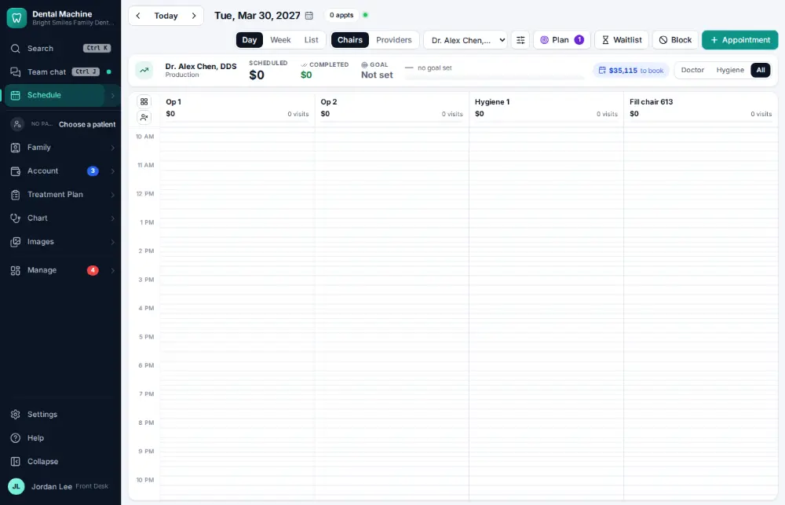
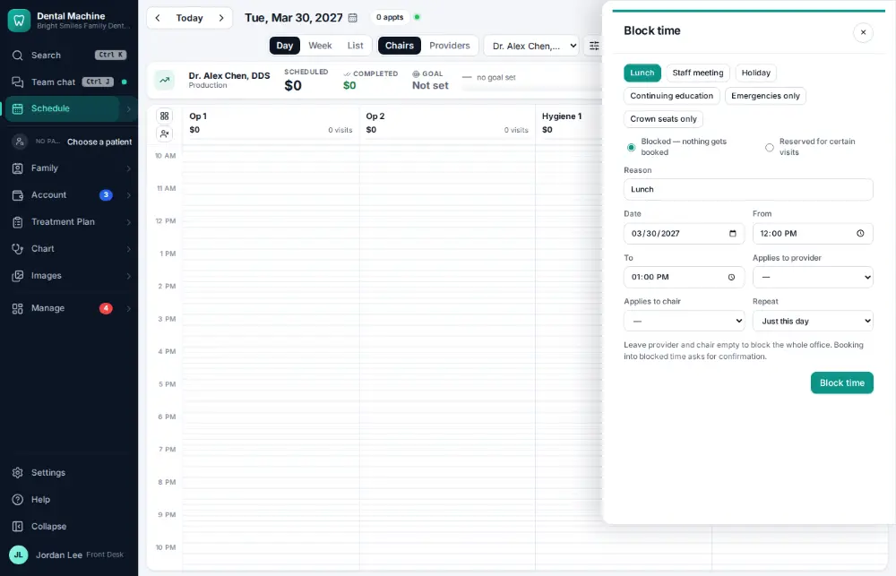
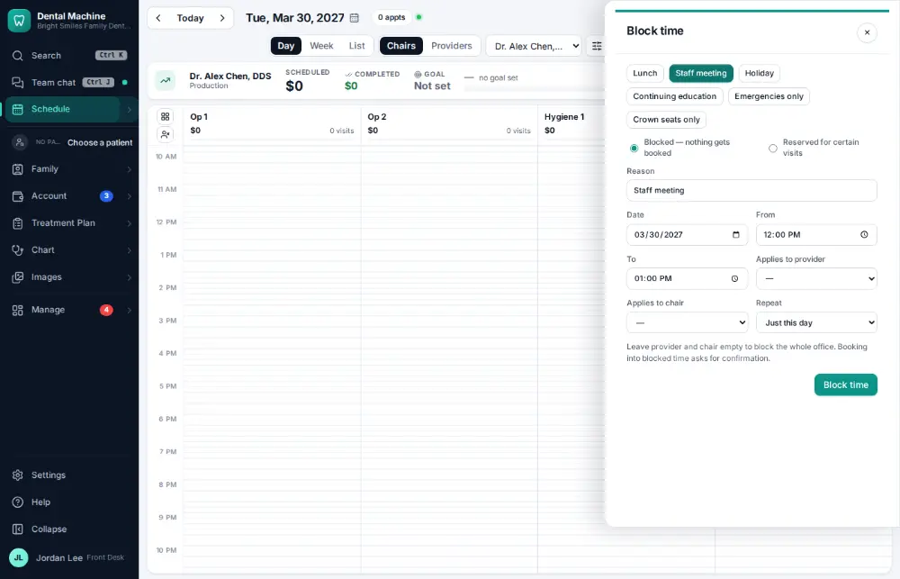
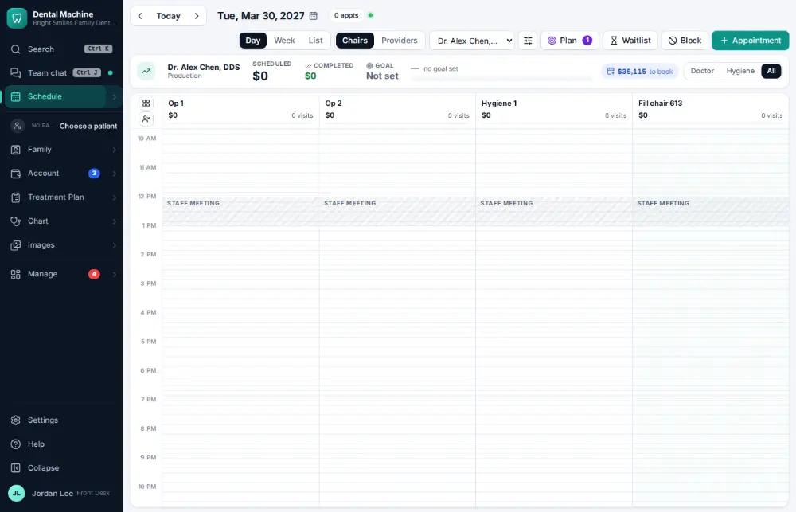

# How do I block time on the schedule?

**Who:** front desk, office manager · **Where:** Schedule → Block time (⊘ above the schedule) · **How often:** About weekly

Blocks time on the schedule so nothing is booked there. Reasons like “Staff meeting” fill in the usual time.

## Where to start

## Steps

1. Click the "Block time" button (the ⊘ icon above the schedule)

   

2. Click the "Staff meeting" chip (reason filled in; 12:00–1:00, whole office by default)

   

3. Click "Block time"

   

## Tips

- A block covers the whole office by default; choose chairs or providers to narrow it.

## Related

- [How do I give a provider a day off or change their hours?](A120-give-a-provider-a-day-off-or-change-their-hours.md)
- [How do I set up a perfect-day schedule template?](A163-set-up-a-perfect-day-schedule-template.md)
- [How do I book a same-day emergency visit?](A082-book-a-same-day-emergency-visit.md)
- [How do I fill an opening from the ASAP list?](A070-fill-an-opening-from-the-asap-list.md)
- [How do I mark a no-show?](A071-mark-a-no-show.md)

---
[All how-tos](README.md) · Action A115 · screenshots from the robot run of 2026-09-25
