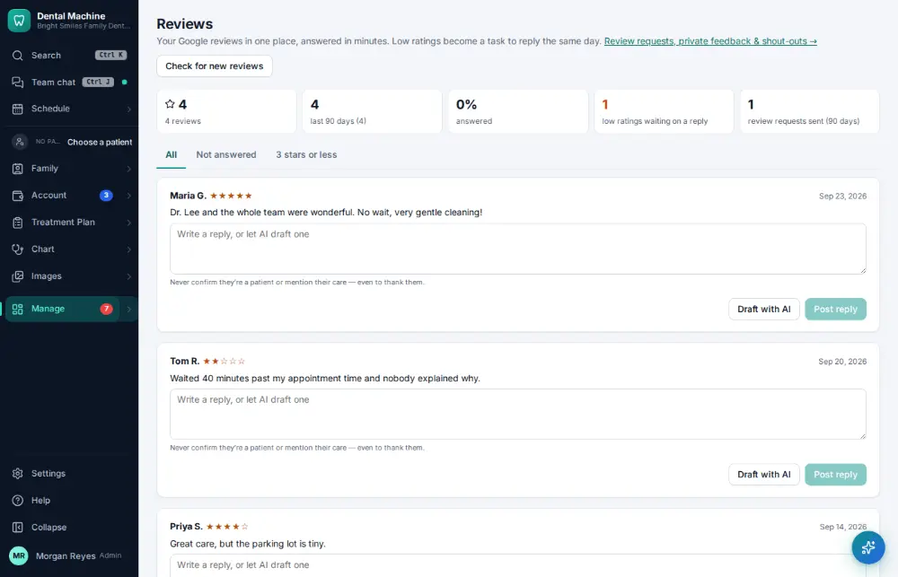
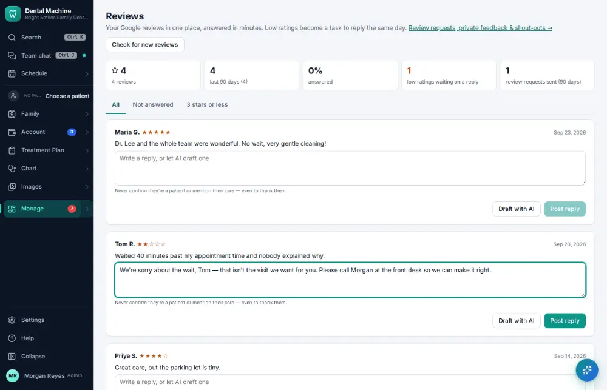
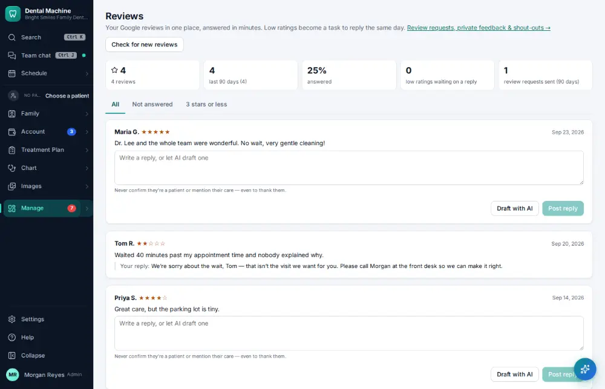

# How do I reply to an online review?

**Who:** office manager · **Where:** Manage ▾ → Reviews · **How often:** About weekly

Reviews shows every Google review once the Google Business Profile is connected. Write a reply (or “Draft with AI”, which never confirms the reviewer is a patient — a HIPAA rule) and post it to Google.

## Where to start

## Steps

1. Reviews: the 2-star review waits at the top. Click its reply box and write the answer

   

2. Click "Post reply": it’s on Google under the review

   

## Tips

- Low ratings become a task automatically.

## If something goes wrong

- **No reviews listed** — Connect the Google Business Profile first (an administrator does this).

## Related

- [How do I read patient feedback?](A130-read-patient-feedback.md)
- [How do I ask a patient for a review?](A065-ask-a-patient-for-a-review.md)
- [How do I send a newsletter or campaign?](A136-send-a-newsletter-or-campaign.md)
- [How do I text a reminder to everyone unconfirmed?](A094-text-a-reminder-to-everyone-unconfirmed.md)
- [How do I send patient education after a visit?](A080-send-patient-education-after-a-visit.md)

---
[All how-tos](README.md) · Action A116 · screenshots from the robot run of 2026-09-25
