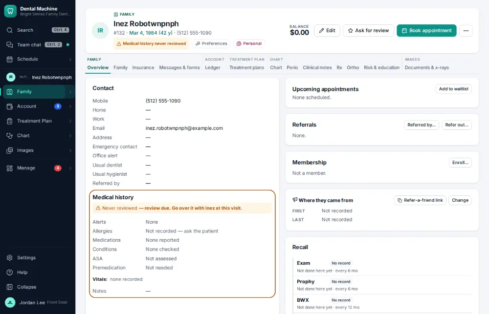
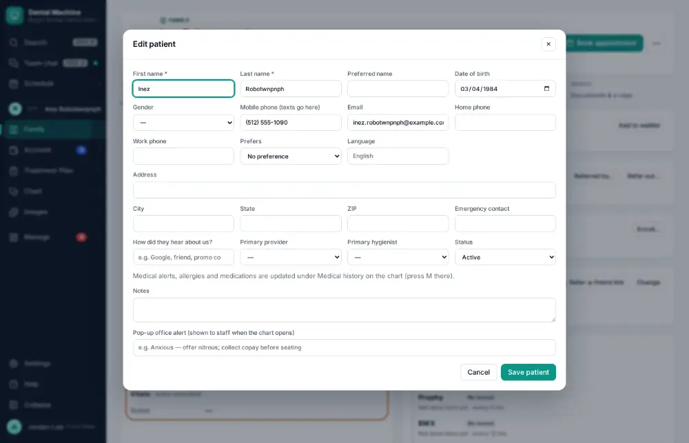
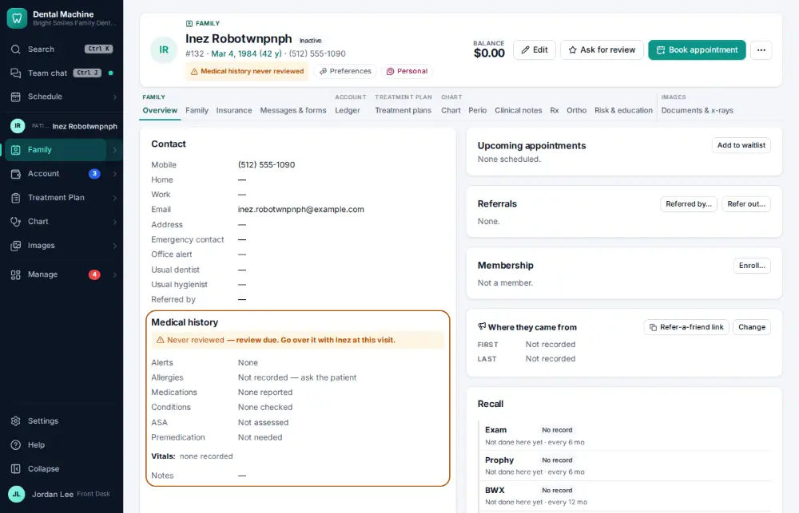

# How do I make a patient inactive?

**Who:** front desk · **Where:** Chart header → Edit → Status · **How often:** About weekly

Making a patient inactive marks them as no longer coming to the office. Their record is kept — nothing is deleted — and they can be made active again the same way.

## Where to start

## Steps

1. Click Edit: the full patient form opens

   

2. Set Status to Inactive and click Save

   

## Tips

- For a patient who has died, see [A179](A179-mark-a-patient-deceased.md).

## Related

- [How do I mark a patient deceased?](A179-mark-a-patient-deceased.md)
- [How do I merge duplicate patient charts?](A121-merge-duplicate-patient-charts.md)
- [How do I correct a patient's name or date of birth?](A143-correct-a-patient-s-name-or-date-of-birth.md)
- [How do I add a family member to a household?](A090-add-a-family-member-to-a-household.md)
- [How do I record who referred a new patient?](A092-record-who-referred-a-new-patient.md)

---
[All how-tos](README.md) · Action A117 · screenshots from the robot run of 2026-09-25
