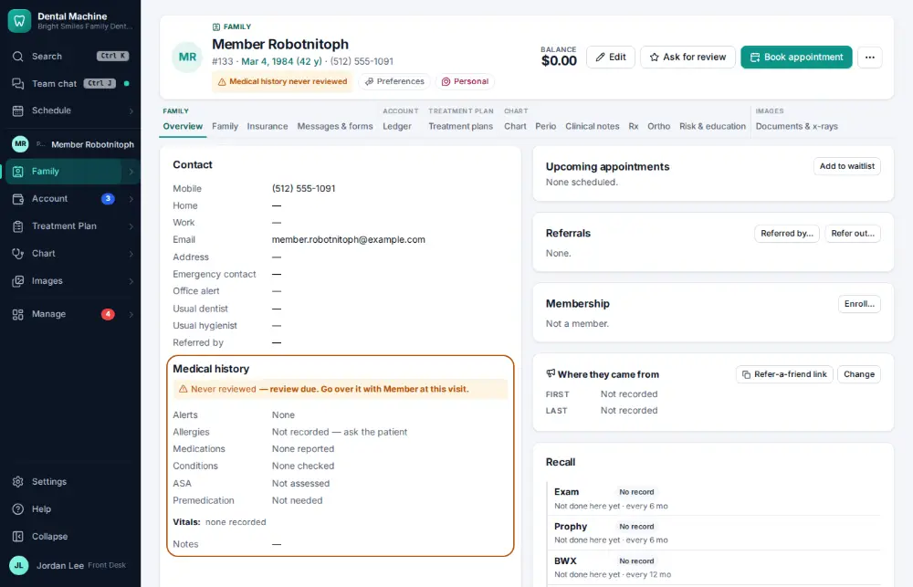
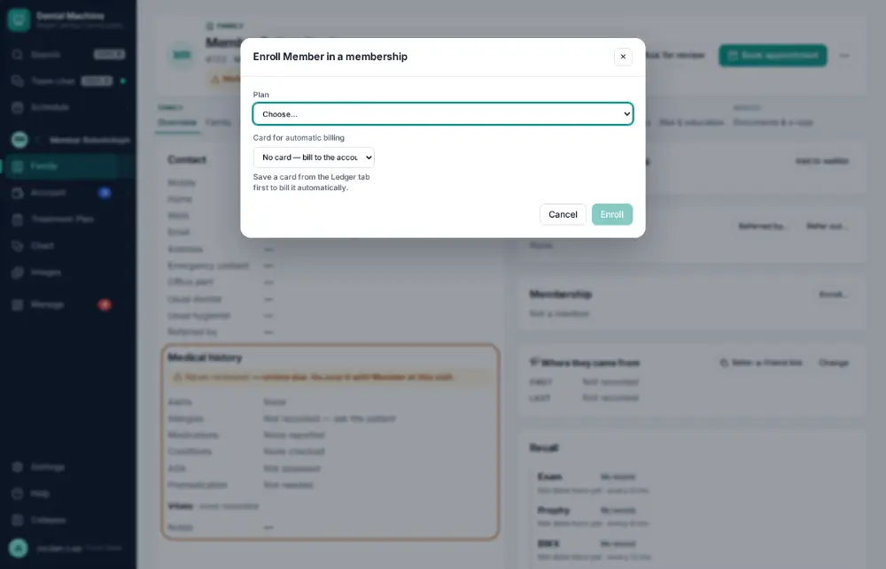
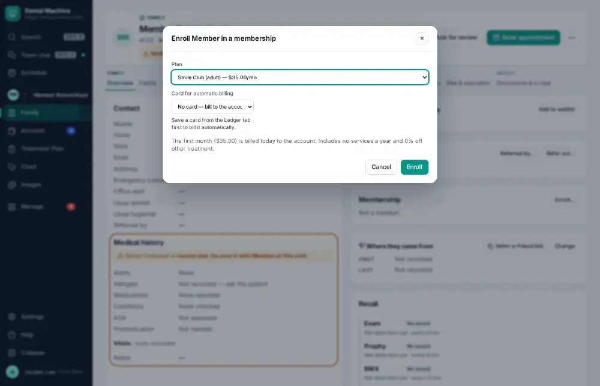
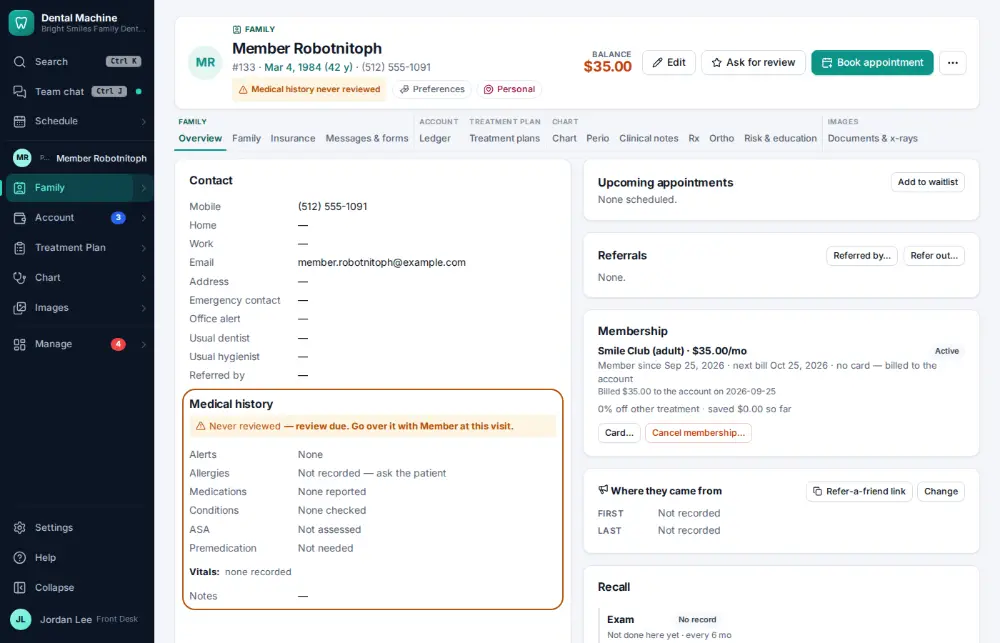

# How do I sign a patient up for the membership plan?

**Who:** front desk · **Where:** Family module → Overview → Membership → Enroll… · **How often:** About weekly

Enroll an uninsured patient in the office’s membership plan.

## Where to start

## Steps

1. Chart overview → Membership: click "Enroll…"

   

2. Pick the plan

   

3. Click Enroll

   

## Tips

- The plans themselves are set up in Settings → Memberships.

## Related

- [How do I set up a payment plan?](A113-set-up-a-payment-plan.md)
- [How do I refund a credit balance?](A110-refund-a-credit-balance.md)
- [How do I send patient statements?](A119-send-patient-statements.md)
- [How do I reconcile insurance payments with the bank?](A127-reconcile-insurance-payments-with-the-bank.md)
- [How do I void a payment posted by mistake?](A102-void-a-payment-posted-by-mistake.md)

---
[All how-tos](README.md) · Action A118 · screenshots from the robot run of 2026-09-25
