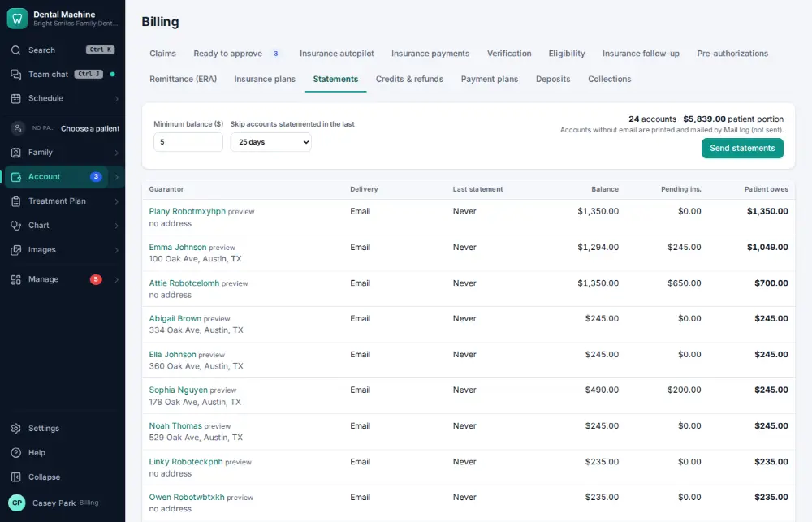
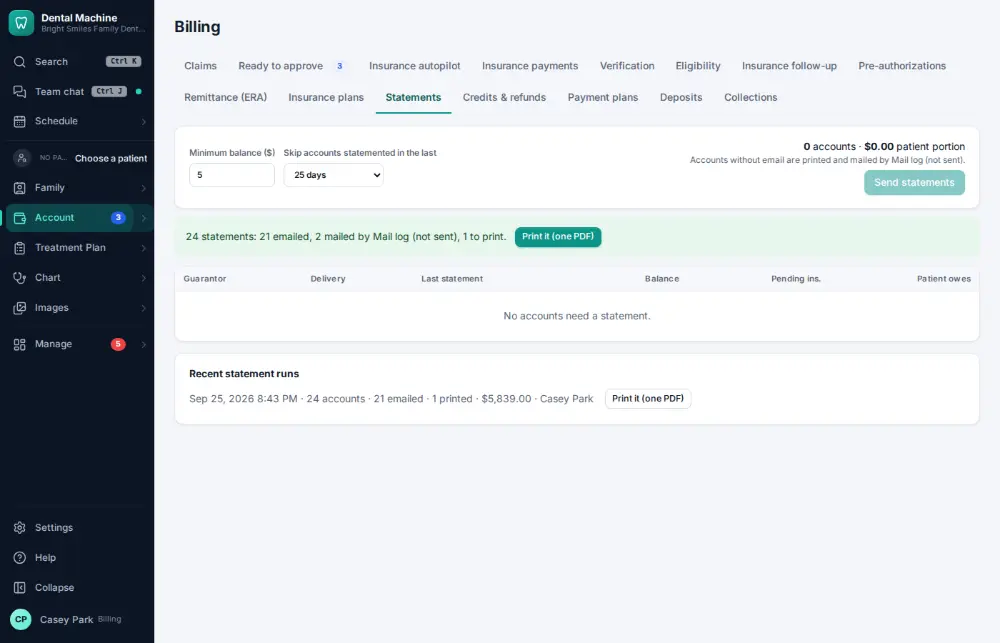

# How do I send patient statements?

**Who:** billing · **Where:** Account ▾ → Billing & claims → Statements · **How often:** About weekly

Sends statements to everyone who owes: by email or text, or through the mail service. Enter again prints the ones that have to be printed, as one PDF.

## Where to start

## Steps

1. Billing → Statements: "Send statements" has focus. Press Enter: sent (email/text/mail service)  
   Keys: <kbd>Enter</kbd>

   

2. Press Enter: every statement that has to be printed comes out as one PDF  
   Keys: <kbd>Enter</kbd>

   

## Related

- [How do I explain a balance (show the ledger)?](A024-explain-a-balance-show-the-ledger.md)
- [How do I send an account to collections?](A147-send-an-account-to-collections.md)
- [How do I reconcile insurance payments with the bank?](A127-reconcile-insurance-payments-with-the-bank.md)
- [How do I refund a credit balance?](A110-refund-a-credit-balance.md)
- [How do I set up a payment plan?](A113-set-up-a-payment-plan.md)

---
[All how-tos](README.md) · Action A119 · screenshots from the robot run of 2026-09-25
