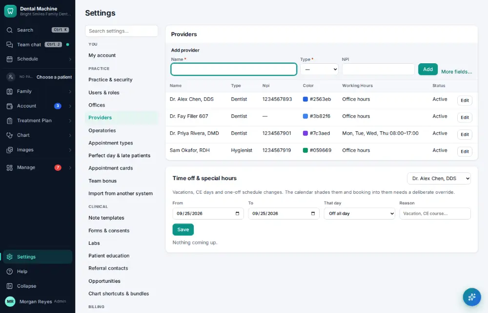
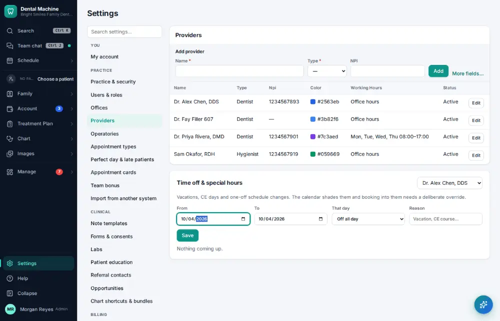
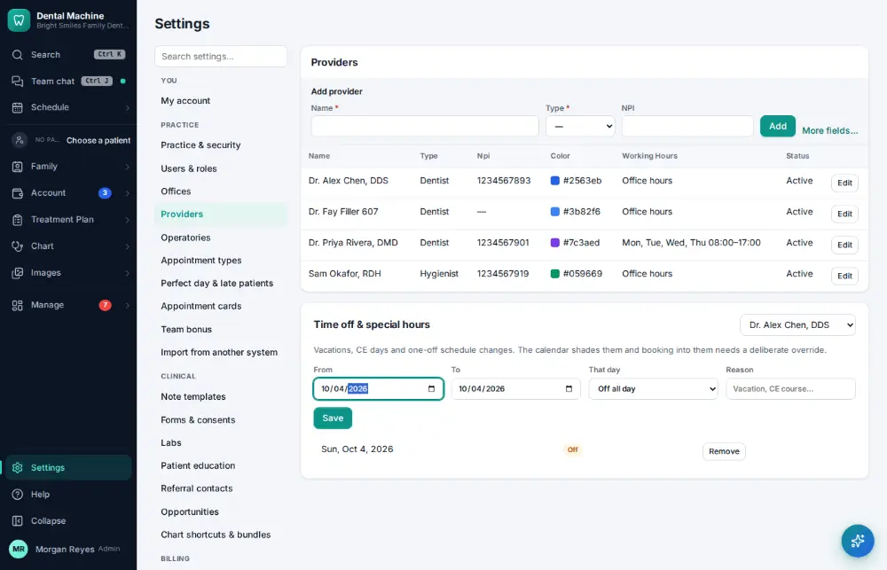

# How do I give a provider a day off or change their hours?

**Who:** office manager · **Where:** Settings → Providers → Time off & special hours · **How often:** About weekly

Give a provider a day off or different hours on a day. “Off all day” is the default.

## Where to start

## Steps

1. Settings → Providers → Time off: click "From" and type the date (Off all day is the default)

   

2. Press Enter: saved  
   Keys: <kbd>Enter</kbd>

   

## Related

- [How do I block time on the schedule?](A115-block-time-on-the-schedule.md)
- [How do I add a provider?](A172-add-a-provider.md)
- [How do I set up a perfect-day schedule template?](A163-set-up-a-perfect-day-schedule-template.md)
- [How do I book a same-day emergency visit?](A082-book-a-same-day-emergency-visit.md)
- [How do I fill an opening from the ASAP list?](A070-fill-an-opening-from-the-asap-list.md)

---
[All how-tos](README.md) · Action A120 · screenshots from the robot run of 2026-09-25
