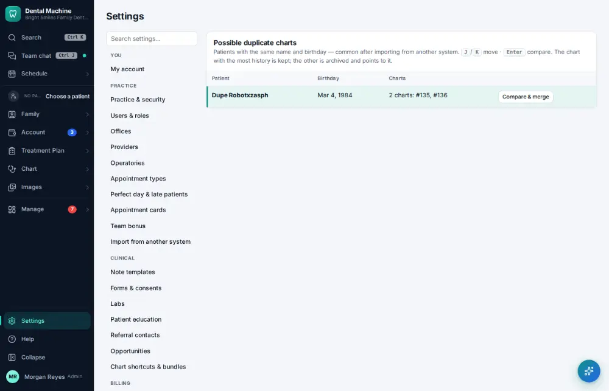
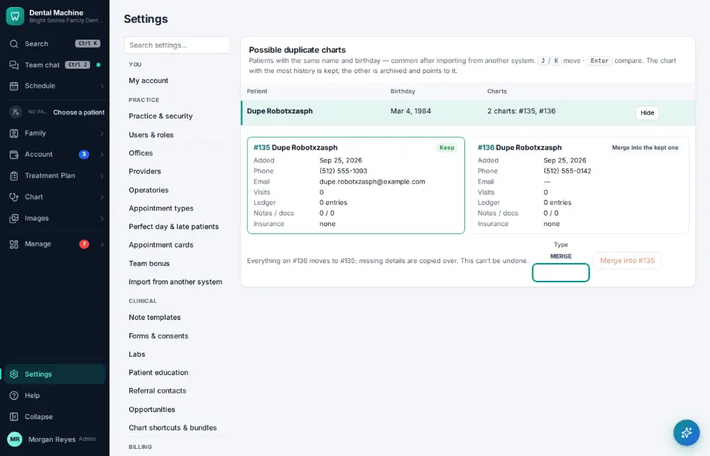
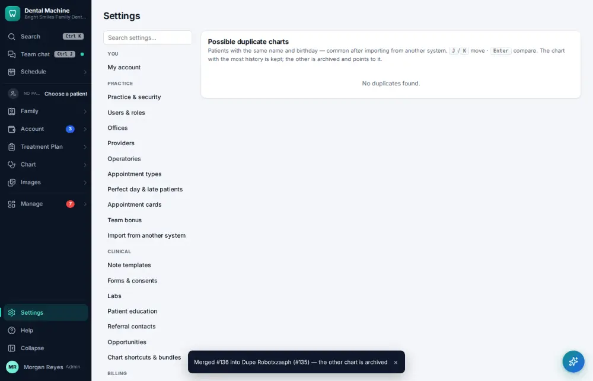

# How do I merge duplicate patient charts?

**Who:** office manager · **Where:** Settings → Duplicate charts · **How often:** About weekly

Duplicate charts lists pairs that look like the same person. Compare them side by side, then type MERGE: everything moves to one chart and the duplicate is archived (not deleted).

## Where to start

## Steps

1. Settings → Duplicate charts: the pair is highlighted. Press Enter: side-by-side comparison  
   Keys: <kbd>Enter</kbd>

   

2. Type MERGE and press Enter: merged, the duplicate is archived  
   Keys: type “MERGE” <kbd>Enter</kbd>

   

## Tips

- J/K move between pairs; Enter compares them.

## If something goes wrong

- **“Only administrators can merge patients”** — Ask an administrator.
- **“That chart was already merged into another one”** — Refresh the list.

## Related

- [How do I set up a new patient?](A055-set-up-a-new-patient.md)
- [How do I make a patient inactive?](A117-make-a-patient-inactive.md)
- [How do I correct a patient's name or date of birth?](A143-correct-a-patient-s-name-or-date-of-birth.md)
- [How do I add a family member to a household?](A090-add-a-family-member-to-a-household.md)
- [How do I record who referred a new patient?](A092-record-who-referred-a-new-patient.md)

---
[All how-tos](README.md) · Action A121 · screenshots from the robot run of 2026-09-25
