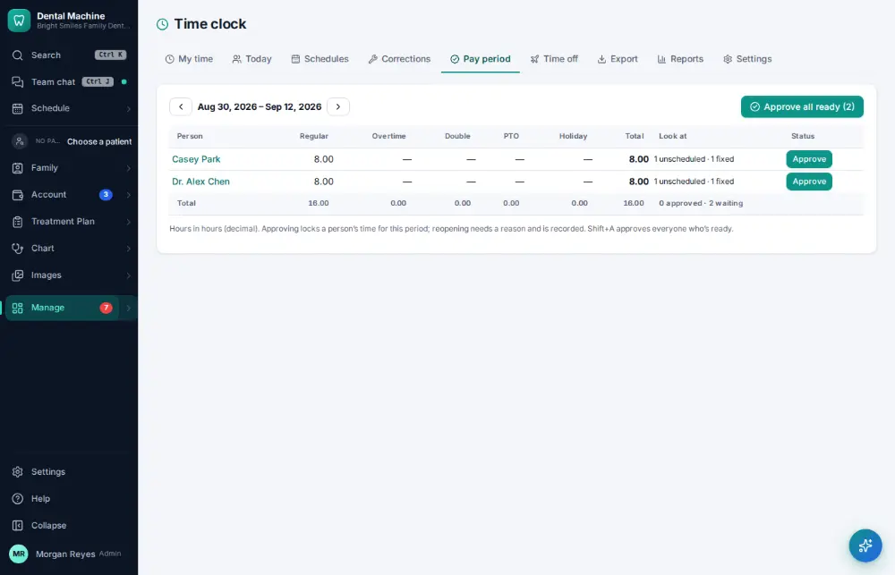
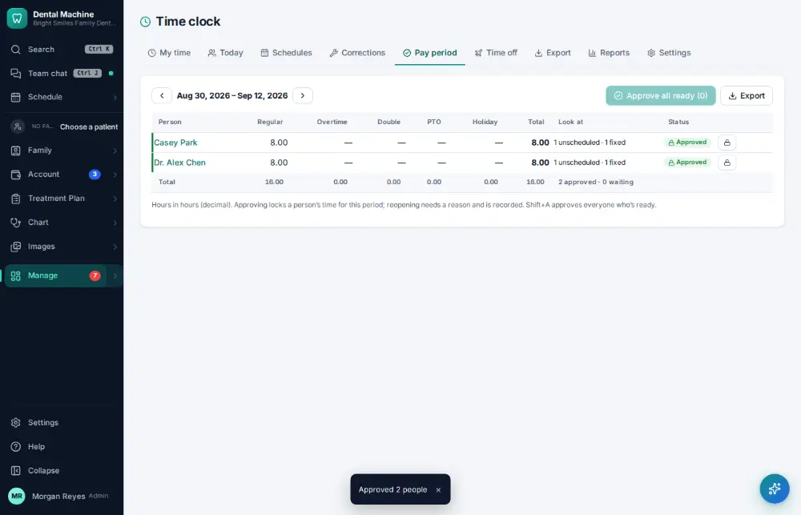

# How do I approve payroll hours?

**Who:** office manager · **Where:** Manage ▾ → Time clock → Pay period · **How often:** About weekly

The pay period shows everyone’s hours with overtime worked out. Approve them before exporting payroll.

## Steps

1. Press Ctrl/⌘K, type "approve payroll hours", Enter: the pay period that just ended  
   Keys: <kbd>Ctrl/⌘ K</kbd> type “approve payroll hours” <kbd>Enter</kbd>

   

2. Press Shift+A: everyone whose hours are ready is approved (locked for payroll)  
   Keys: <kbd>Shift A</kbd>

   

## Tips

- Shift+A approves everyone who is ready.

## Related

- [How do I export payroll?](A138-export-payroll.md)
- [How do I fix a missed time-clock punch?](A107-fix-a-missed-time-clock-punch.md)
- [How do I edit staff work schedules?](A123-edit-staff-work-schedules.md)
- [How do I check my bonus?](A131-check-my-bonus.md)
- [How do I request time off?](A133-request-time-off.md)

---
[All how-tos](README.md) · Action A122 · screenshots from the robot run of 2026-09-25
