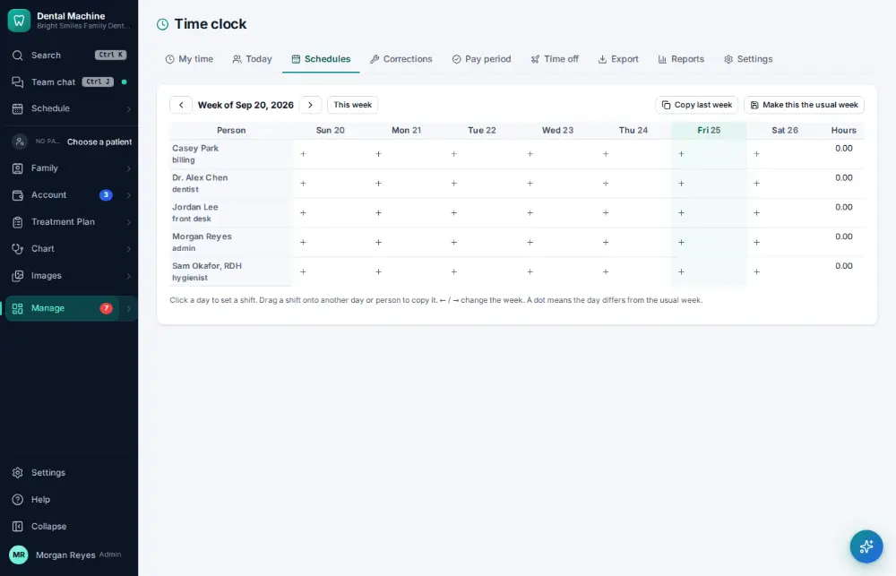
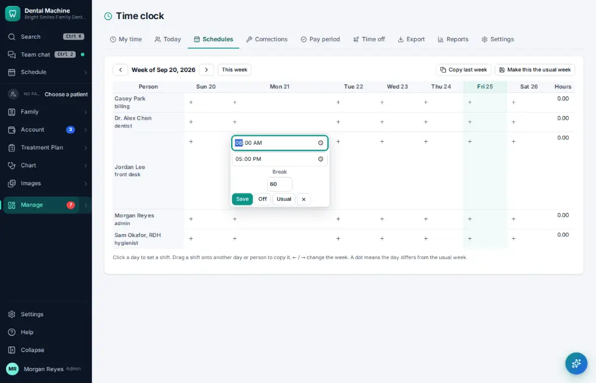
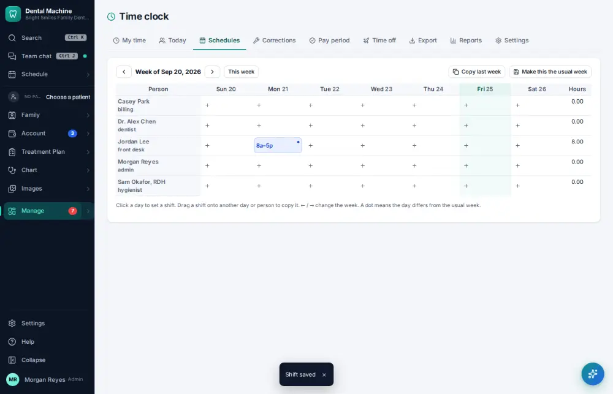

# How do I edit staff work schedules?

**Who:** office manager · **Where:** Manage ▾ → Time clock → Schedules · **How often:** About weekly

Set each person’s shifts for the week. Their usual hours are filled in.

## Where to start

## Steps

1. Time clock → Schedules: click Jordan’s Monday

   

2. The usual hours are filled in; click Save

   

## Tips

- ← and → move between weeks.

## Related

- [How do I request time off?](A133-request-time-off.md)
- [How do I see who is clocked in today?](A100-see-who-is-clocked-in-today.md)
- [How do I approve payroll hours?](A122-approve-payroll-hours.md)
- [How do I check my bonus?](A131-check-my-bonus.md)
- [How do I approve a time-off request?](A134-approve-a-time-off-request.md)

---
[All how-tos](README.md) · Action A123 · screenshots from the robot run of 2026-09-25
