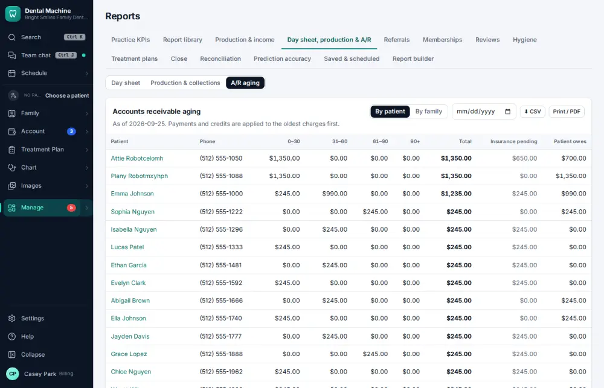

# How do I review insurance A/R aging?

**Who:** billing, office manager · **Where:** Manage ▾ → Reports → Day sheet, production & A/R · **How often:** About weekly

Who owes what, grouped by how old the balance is.

## Steps

1. Press Ctrl/⌘K, type "A/R aging", Enter: who owes what, by age  
   Keys: <kbd>Ctrl/⌘ K</kbd> type “a/r aging” <kbd>Enter</kbd>

   

## Related

- [How do I call an insurance company about an unpaid claim?](A075-call-an-insurance-company-about-an-unpaid-claim.md)
- [How do I send an account to collections?](A147-send-an-account-to-collections.md)
- [How do I check the day sheet at the end of the day?](A085-check-the-day-sheet-at-the-end-of-the-day.md)
- [How do I review phone results?](A128-review-phone-results.md)
- [How do I review schedule capacity?](A129-review-schedule-capacity.md)

---
[All how-tos](README.md) · Action A124 · screenshots from the robot run of 2026-09-25
