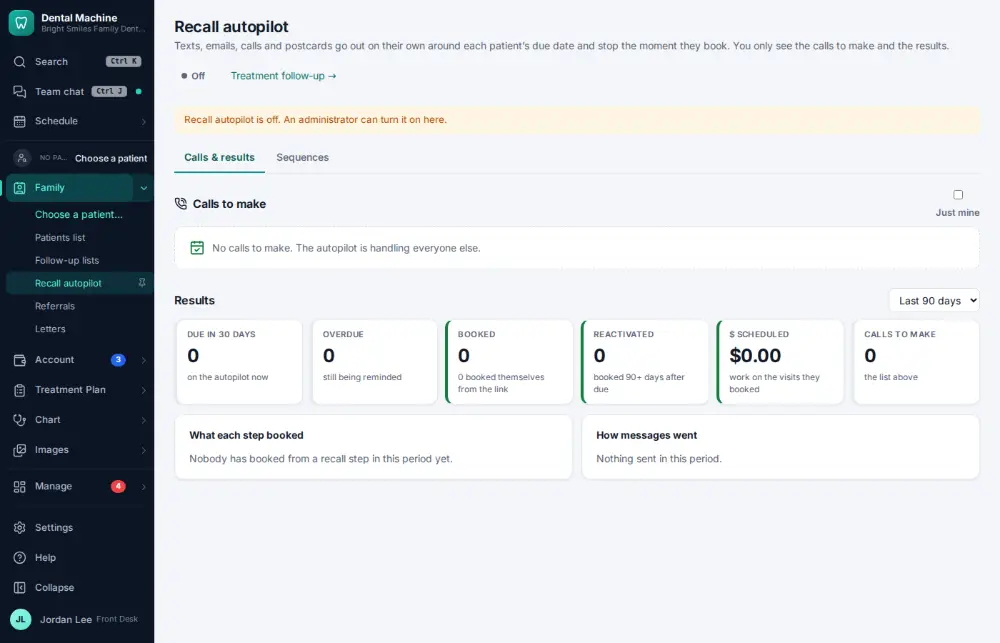

# How do I check what the recall autopilot did?

**Who:** office manager, front desk · **Where:** Family ▾ → Recall autopilot · **How often:** About weekly

The recall autopilot reminds patients who are due for their cleaning. This page shows what it sent and what came of it, and the calls a person still needs to make.

## Steps

1. In the menu open Family ▾ and click "Recall autopilot": what it sent and booked this week

   

## Related

- [How do I call a patient who is due for recall?](A037-call-a-patient-who-is-due-for-recall.md)
- [How do I check treatment follow-up results?](A126-check-treatment-follow-up-results.md)
- [How do I work the broken-appointments list?](A093-work-the-broken-appointments-list.md)
- [How do I change a patient's recall interval?](A097-change-a-patient-s-recall-interval.md)
- [How do I call a patient about unscheduled treatment?](A057-call-a-patient-about-unscheduled-treatment.md)

---
[All how-tos](README.md) · Action A125 · screenshots from the robot run of 2026-09-25
