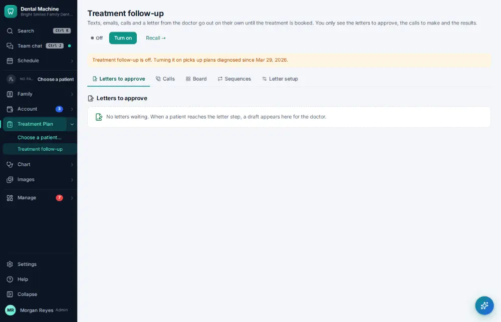

# How do I check treatment follow-up results?

**Who:** office manager · **Where:** Treatment Plan ▾ → Treatment follow-up · **How often:** About weekly

Treatment follow-up reminds patients about planned treatment they haven’t booked, and shows the results.

## Steps

1. In the menu open Treatment Plan ▾ and click "Treatment follow-up": who was reminded and who booked

   

## Tips

- J/K move between letters; A approves and sends one; X ticks it for a batch.

## Related

- [How do I call a patient about unscheduled treatment?](A057-call-a-patient-about-unscheduled-treatment.md)
- [How do I check what the recall autopilot did?](A125-check-what-the-recall-autopilot-did.md)
- [How do I work the broken-appointments list?](A093-work-the-broken-appointments-list.md)
- [How do I change a patient's recall interval?](A097-change-a-patient-s-recall-interval.md)
- [How do I mark a recall call as “left a message”?](A051-mark-a-recall-call-as-left-a-message.md)

---
[All how-tos](README.md) · Action A126 · screenshots from the robot run of 2026-09-25
