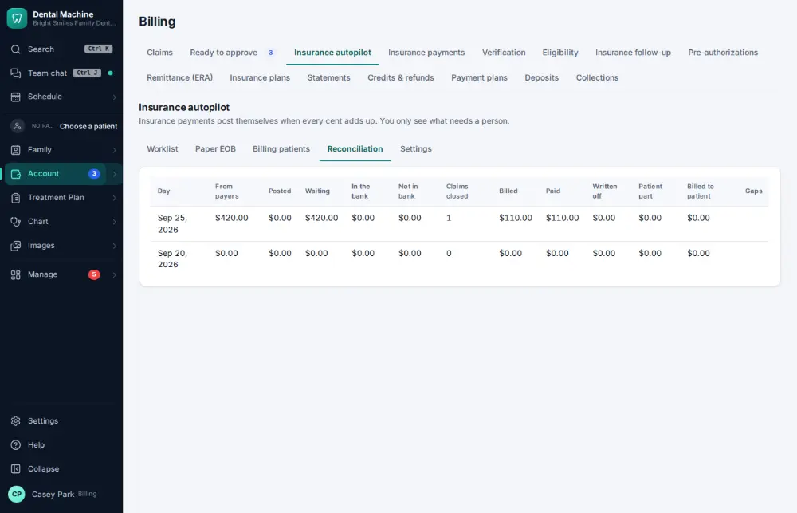

# How do I reconcile insurance payments with the bank?

**Who:** billing · **Where:** Account ▾ → Billing & claims → Insurance autopilot → Reconciliation · **How often:** About weekly

Matches the insurance payments posted in the ledger with the money that reached the bank, and shows what doesn’t match.

## Steps

1. Press Ctrl/⌘K, type "insurance reconciliation", Enter  
   Keys: <kbd>Ctrl/⌘ K</kbd> type “insurance reconciliation” <kbd>Enter</kbd>

   

## Related

- [How do I post an insurance payment from an ERA?](A063-post-an-insurance-payment-from-an-era.md)
- [How do I reconcile the bank and books?](A148-reconcile-the-bank-and-books.md)
- [How do I make the daily bank deposit?](A084-make-the-daily-bank-deposit.md)
- [How do I send patient statements?](A119-send-patient-statements.md)
- [How do I refund a credit balance?](A110-refund-a-credit-balance.md)

---
[All how-tos](README.md) · Action A127 · screenshots from the robot run of 2026-09-25
