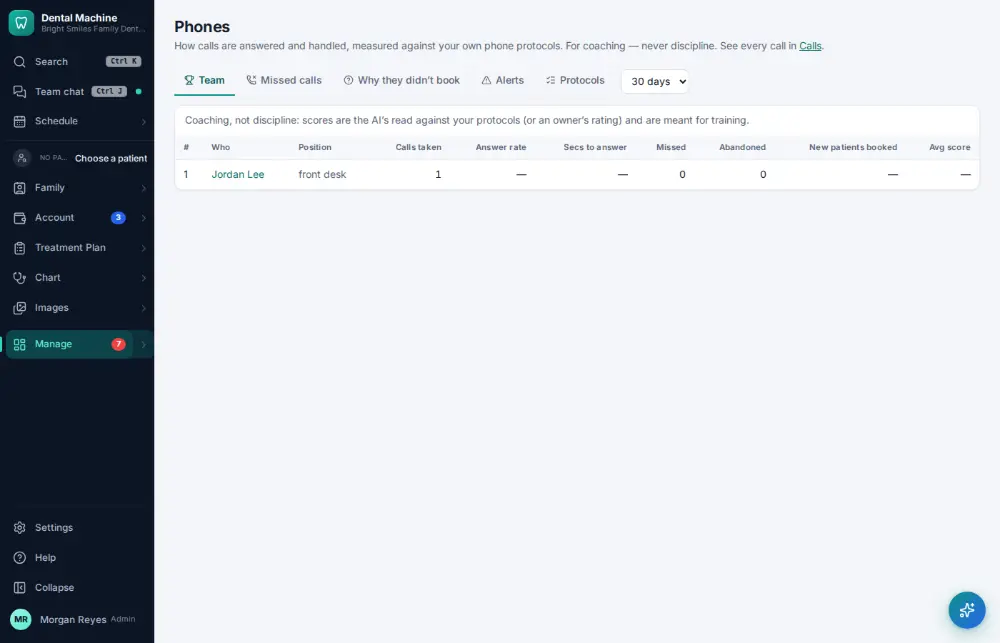

# How do I review phone results?

**Who:** office manager · **Where:** Manage ▾ → Phones · **How often:** About weekly

Calls, missed calls and why callers didn’t book, by day and by person.

## Steps

1. Press Ctrl/⌘K, type "phones", Enter: calls, missed calls and why callers didn’t book  
   Keys: <kbd>Ctrl/⌘ K</kbd> type “phones” <kbd>Enter</kbd>

   

## Related

- [How do I answer a call and open the caller's chart?](A004-answer-a-call-and-open-the-caller-s-chart.md)
- [How do I look at marketing results?](A149-look-at-marketing-results.md)
- [How do I review insurance A/R aging?](A124-review-insurance-a-r-aging.md)
- [How do I review schedule capacity?](A129-review-schedule-capacity.md)
- [How do I see what pays?](A137-see-what-pays.md)

---
[All how-tos](README.md) · Action A128 · screenshots from the robot run of 2026-09-25
