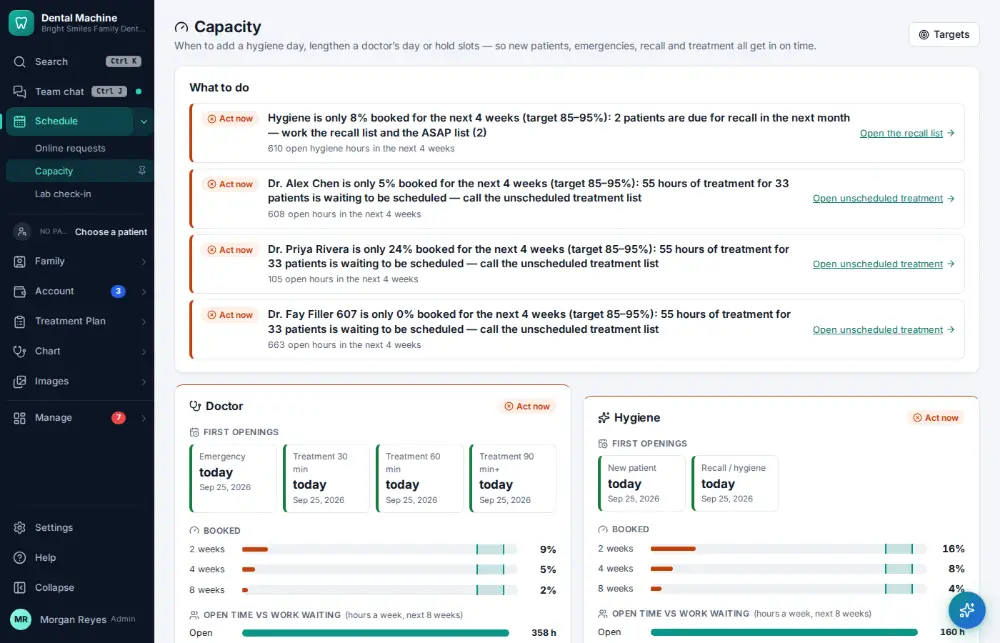

# How do I review schedule capacity?

**Who:** office manager · **Where:** Schedule ▾ → Capacity · **How often:** About weekly

How full the schedule is ahead, by provider and chair, against your targets.

## Steps

1. In the menu open Schedule ▾ and click "Capacity"

   

## Tips

- T edits the targets; R refreshes.

## Related

- [How do I check practice KPIs and metrics?](A105-check-practice-kpis-and-metrics.md)
- [How do I set up a perfect-day schedule template?](A163-set-up-a-perfect-day-schedule-template.md)
- [How do I review insurance A/R aging?](A124-review-insurance-a-r-aging.md)
- [How do I review phone results?](A128-review-phone-results.md)
- [How do I see what pays?](A137-see-what-pays.md)

---
[All how-tos](README.md) · Action A129 · screenshots from the robot run of 2026-09-25
