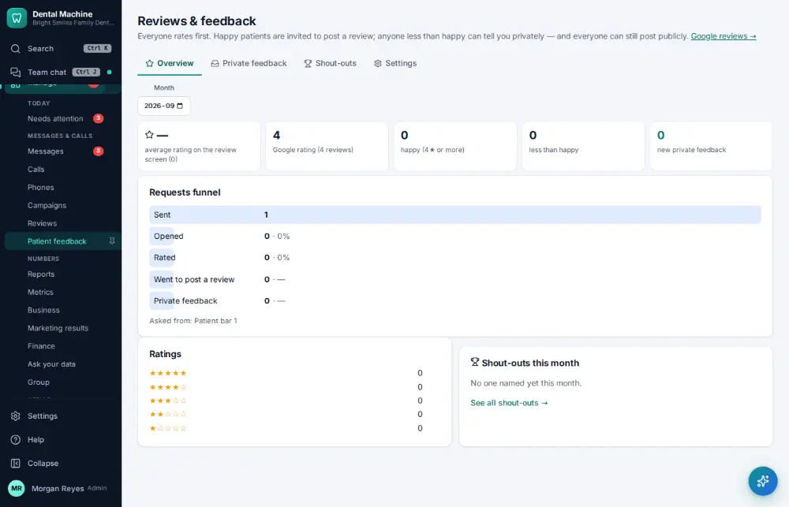

# How do I read patient feedback?

**Who:** office manager · **Where:** Manage ▾ → Patient feedback · **How often:** About weekly

Ratings and comments patients left after their visits, including private feedback and team shout-outs.

## Steps

1. In the menu open Manage ▾ and click "Patient feedback"

   

## Related

- [How do I ask a patient for a review?](A065-ask-a-patient-for-a-review.md)
- [How do I reply to an online review?](A116-reply-to-an-online-review.md)
- [How do I send a newsletter or campaign?](A136-send-a-newsletter-or-campaign.md)
- [How do I text a reminder to everyone unconfirmed?](A094-text-a-reminder-to-everyone-unconfirmed.md)
- [How do I send patient education after a visit?](A080-send-patient-education-after-a-visit.md)

---
[All how-tos](README.md) · Action A130 · screenshots from the robot run of 2026-09-25
