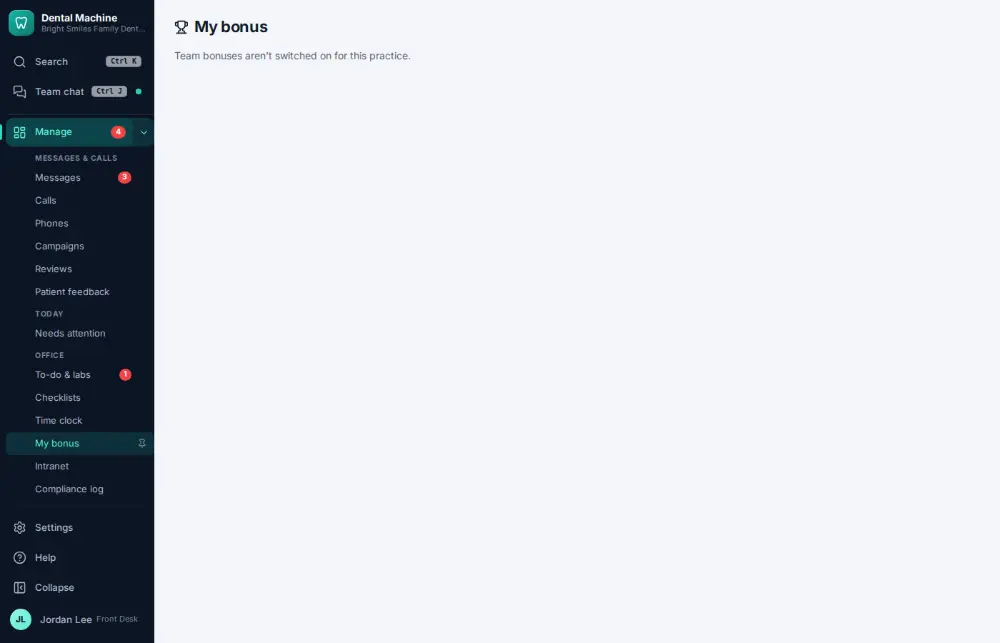

# How do I check my bonus?

**Who:** everyone · **Where:** Manage ▾ → My bonus · **How often:** About weekly

Shows the team bonus plan and how close the team is to it.

## Steps

1. In the menu open Manage ▾ and click "My bonus"

   

## Related

- [How do I set up the team bonus?](A162-set-up-the-team-bonus.md)
- [How do I approve payroll hours?](A122-approve-payroll-hours.md)
- [How do I edit staff work schedules?](A123-edit-staff-work-schedules.md)
- [How do I request time off?](A133-request-time-off.md)
- [How do I approve a time-off request?](A134-approve-a-time-off-request.md)

---
[All how-tos](README.md) · Action A131 · screenshots from the robot run of 2026-09-25
