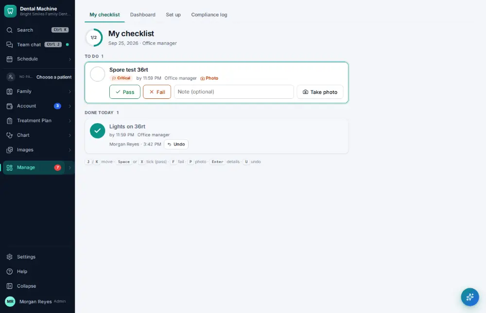
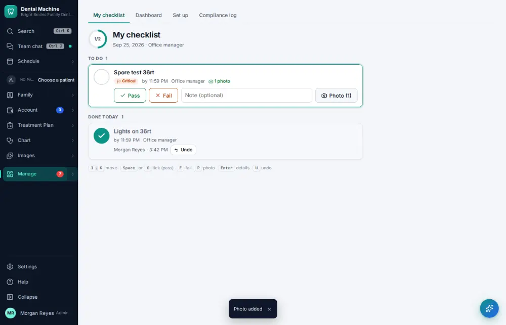
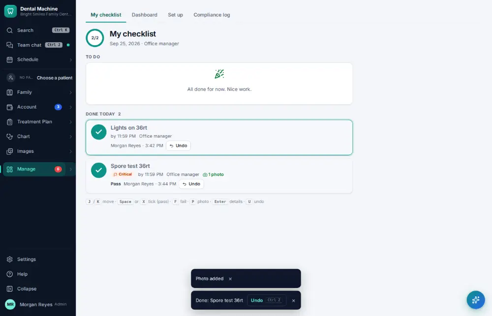

# How do I log a sterilizer spore test?

**Who:** assistant · **Where:** Manage ▾ → Checklists · **How often:** About weekly

The spore test is an item on a checklist: take a photo of the strip and record Pass or Fail. The photo is kept with the result.

## Where to start

## Steps

1. On the spore-test item click "photo" and take/choose the picture of the test strip

   

2. Click "Pass": recorded with its photo and ticked

   

## Related

- [How do I complete the opening or closing checklist?](A079-complete-the-opening-or-closing-checklist.md)
- [How do I log an exposure or sharps injury?](A169-log-an-exposure-or-sharps-injury.md)
- [How do I give a patient a copy of their record?](A141-give-a-patient-a-copy-of-their-record.md)
- [How do I file an office document?](A153-file-an-office-document.md)
- [How do I fix unsigned or incomplete notes?](A095-fix-unsigned-or-incomplete-notes.md)

---
[All how-tos](README.md) · Action A132 · screenshots from the robot run of 2026-09-25
