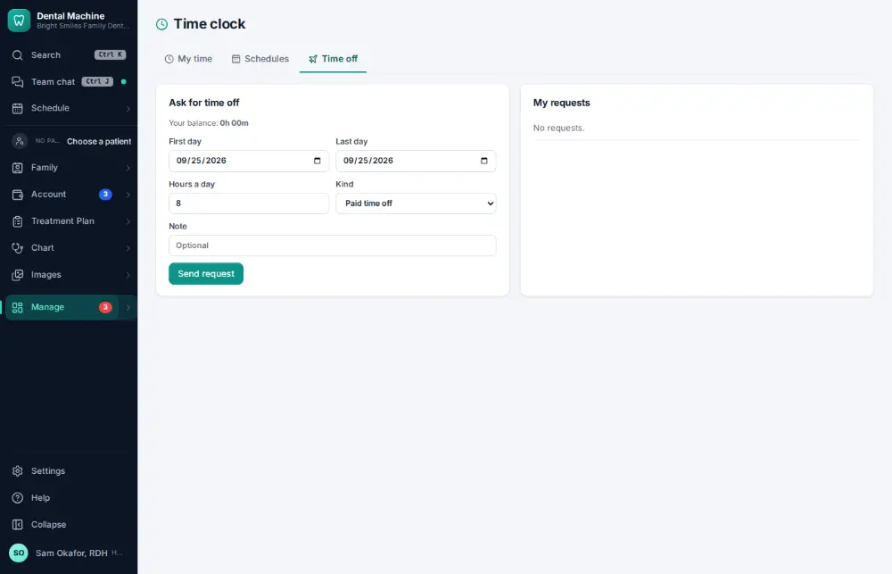
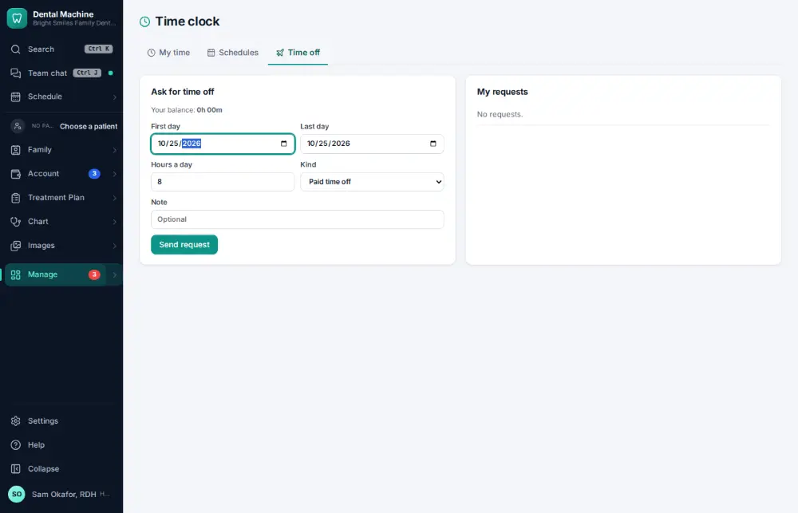
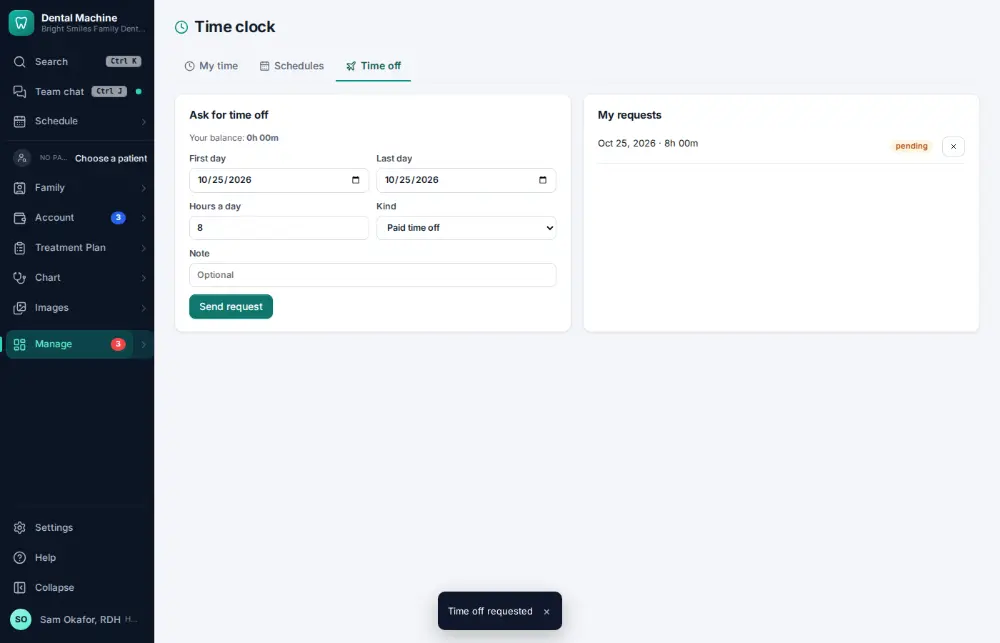

# How do I request time off?

**Who:** everyone · **Where:** Manage ▾ → Time clock → Time off · **How often:** About weekly

Ask for time off; your manager is told and approves or declines it.

## Where to start

## Steps

1. Time clock → Time off: set the first day (today is filled in)

   

2. Click "Send request": the manager is told

   

## If something goes wrong

- **“The last day must be on or after the first”** — Check the dates.

## Related

- [How do I approve a time-off request?](A134-approve-a-time-off-request.md)
- [How do I edit staff work schedules?](A123-edit-staff-work-schedules.md)
- [How do I approve payroll hours?](A122-approve-payroll-hours.md)
- [How do I check my bonus?](A131-check-my-bonus.md)
- [How do I export payroll?](A138-export-payroll.md)

---
[All how-tos](README.md) · Action A133 · screenshots from the robot run of 2026-09-25
