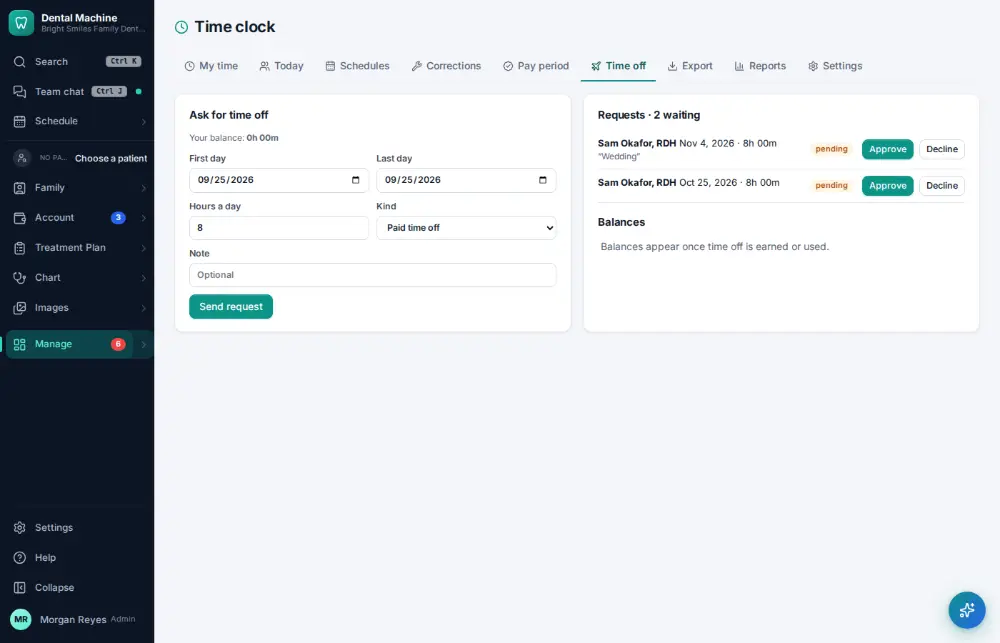
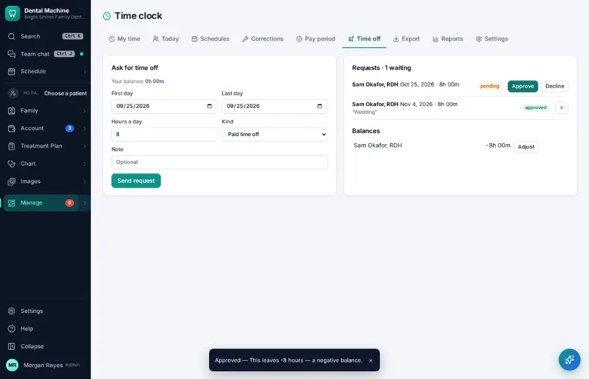

# How do I approve a time-off request?

**Who:** office manager · **Where:** Manage ▾ → Time clock → Time off → Requests · **How often:** About weekly

Approve (or decline, with a reason the person sees) a time-off request.

## Where to start

## Steps

1. Time clock → Time off → Requests: click "Approve" on Sam’s request

   

## Related

- [How do I request time off?](A133-request-time-off.md)
- [How do I approve payroll hours?](A122-approve-payroll-hours.md)
- [How do I edit staff work schedules?](A123-edit-staff-work-schedules.md)
- [How do I check my bonus?](A131-check-my-bonus.md)
- [How do I export payroll?](A138-export-payroll.md)

---
[All how-tos](README.md) · Action A134 · screenshots from the robot run of 2026-09-25
