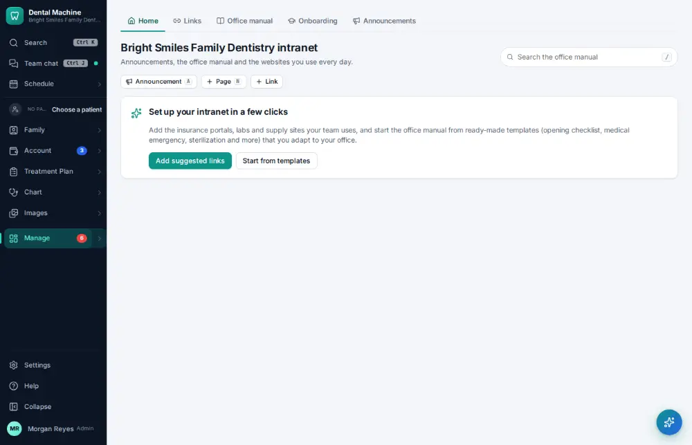
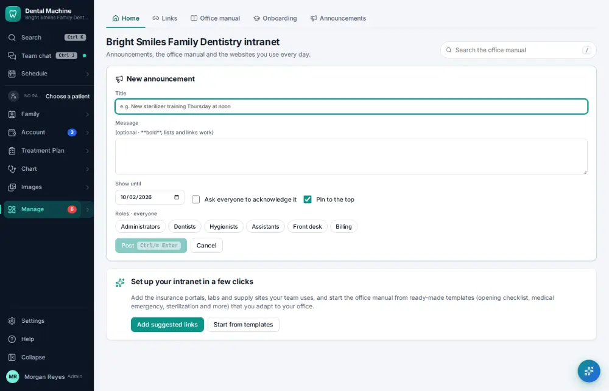
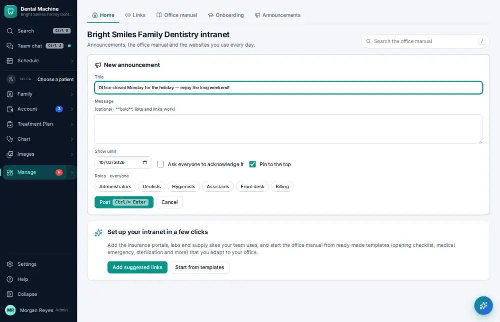
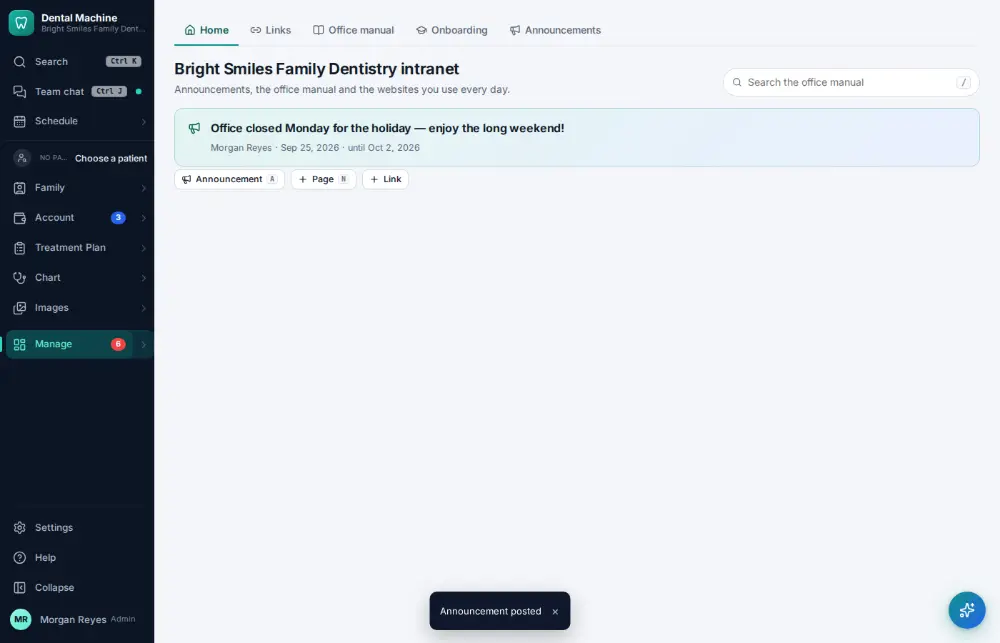

# How do I post an announcement for the team?

**Who:** office manager · **Where:** Manage ▾ → Intranet → A · **How often:** About monthly

Post an announcement for the whole team; it is pinned for a week.

## Where to start

## Steps

1. Intranet: press A (new announcement)  
   Keys: <kbd>A</kbd>

   

2. Type the announcement (a longer message is Tab and more text; it’s optional)

   

3. Press Ctrl/⌘+Enter: posted (pinned for a week)  
   Keys: <kbd>Ctrl/⌘ Enter</kbd>

   

## Related

- [How do I read the office manual?](A108-read-the-office-manual.md)
- [How do I send a message in staff chat?](A036-send-a-message-in-staff-chat.md)
- [How do I run the morning huddle?](A083-run-the-morning-huddle.md)
- [How do I complete the opening or closing checklist?](A079-complete-the-opening-or-closing-checklist.md)
- [How do I work the Needs attention list?](A049-work-the-needs-attention-list.md)

---
[All how-tos](README.md) · Action A135 · screenshots from the robot run of 2026-09-25
