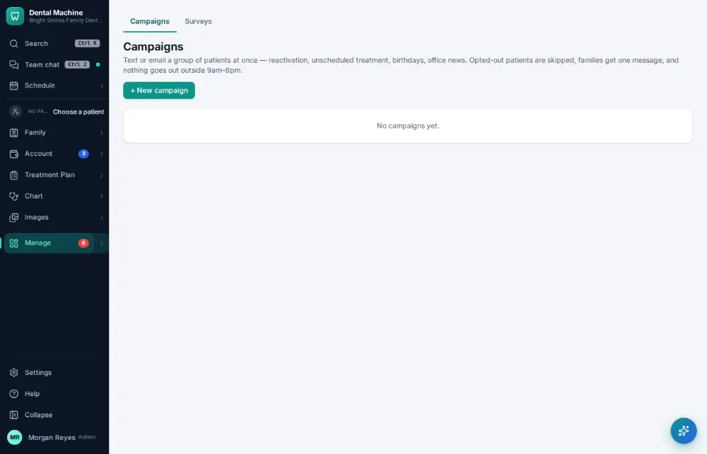
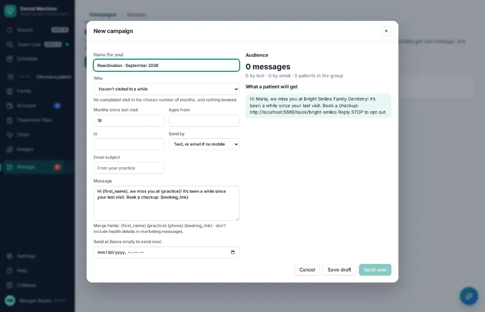
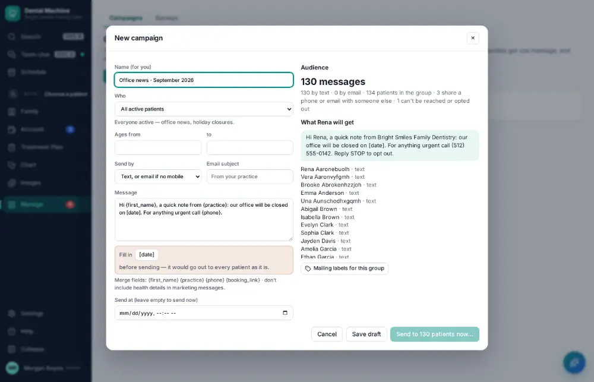
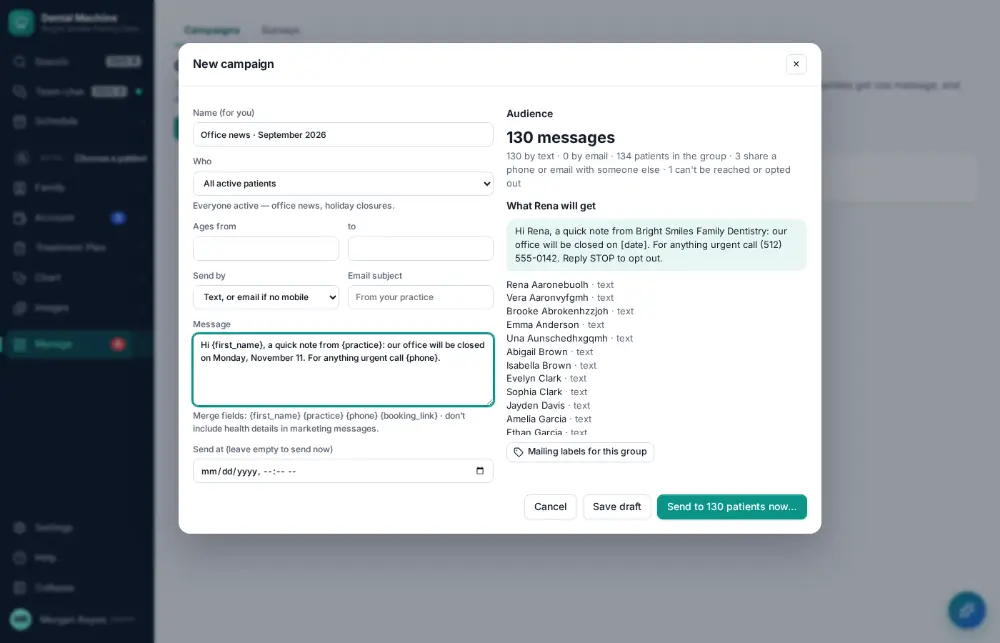
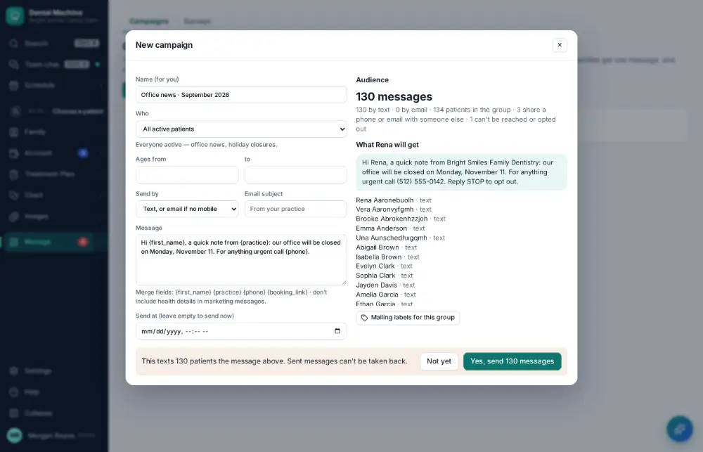
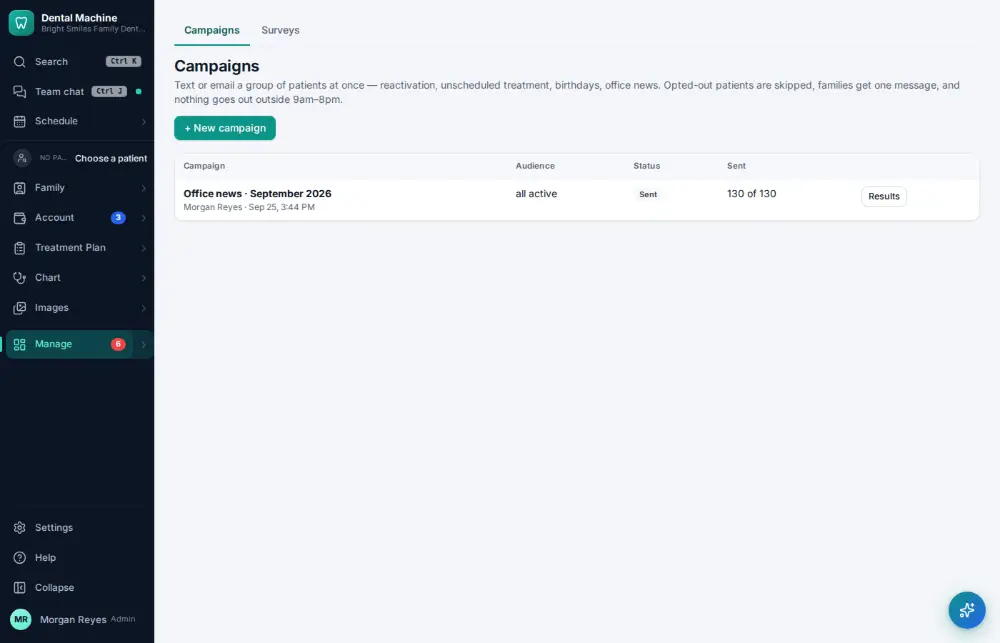

# How do I send a newsletter or campaign?

**Who:** office manager · **Where:** Manage ▾ → Campaigns · **How often:** About monthly

Send a message to a group of patients (reactivation, office news). The campaign is named and written for you; pick who gets it, fill in anything in [brackets], and send. It can’t be taken back, so this is the one step that asks you to confirm.

## Where to start

## Steps

1. Campaigns: click "+ New campaign" (it is already named, e.g. "Reactivation · October 2026")

   

2. Pick who gets it ("office news": everyone who accepts messages); the message is already written

   

3. The message still says "[date]": click it under the message (it is selected) and type the date

   

4. Click "Send to N patients now…": it says who gets it (N by text, N by email)

   

5. Press Enter on "Yes, send N messages": sent (it can't be taken back, so this one step confirms it)  
   Keys: <kbd>Enter</kbd>

   

## Tips

- Patients who opted out are left out automatically.
- “Mailing labels” prints labels for the audience.

## If something goes wrong

- **The message still says [date] or another bracket** — Click it under the message and type the real text before sending.

## Related

- [How do I print mailing labels?](A177-print-mailing-labels.md)
- [How do I look at marketing results?](A149-look-at-marketing-results.md)
- [How do I read patient feedback?](A130-read-patient-feedback.md)
- [How do I reply to an online review?](A116-reply-to-an-online-review.md)
- [How do I write a letter to a patient from a template?](A171-write-a-letter-to-a-patient-from-a-template.md)

---
[All how-tos](README.md) · Action A136 · screenshots from the robot run of 2026-09-25
