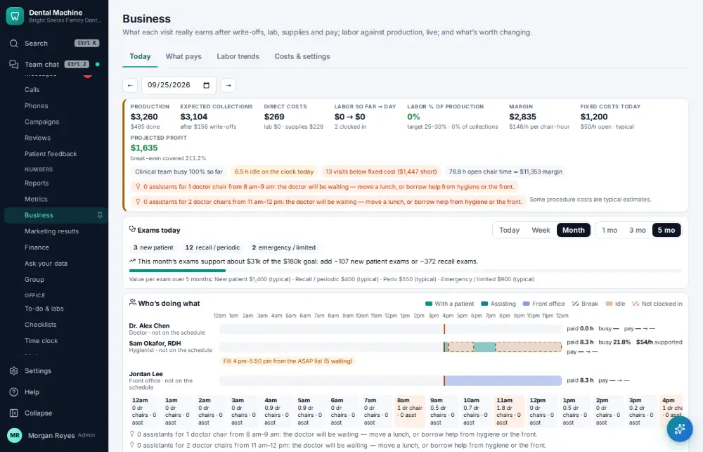

# How do I see what pays?

**Who:** office manager · **Where:** Manage ▾ → Business · **How often:** About monthly

Business shows what pays: what the office earns for the time and the costs that go into it.

## Steps

1. In the menu open Manage ▾ and click "Business": what pays

   

## Related

- [How do I reconcile the bank and books?](A148-reconcile-the-bank-and-books.md)
- [How do I check practice KPIs and metrics?](A105-check-practice-kpis-and-metrics.md)
- [How do I ask a question about your numbers?](A140-ask-a-question-about-your-numbers.md)
- [How do I export a report to a spreadsheet?](A142-export-a-report-to-a-spreadsheet.md)
- [How do I review insurance A/R aging?](A124-review-insurance-a-r-aging.md)

---
[All how-tos](README.md) · Action A137 · screenshots from the robot run of 2026-09-25
