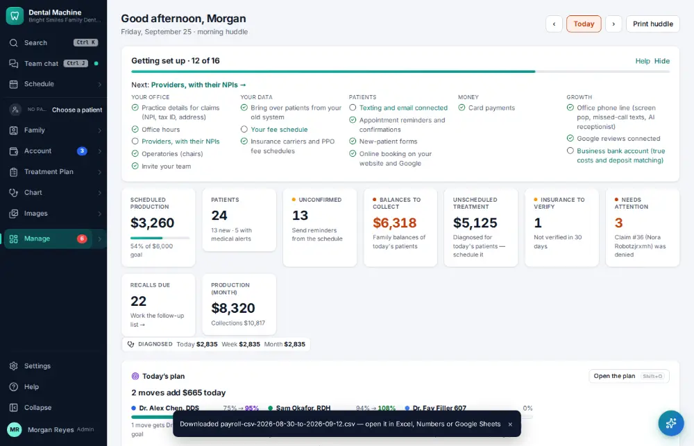

# How do I export payroll?

**Who:** office manager · **Where:** Manage ▾ → Time clock → Export · **How often:** About monthly

Download the approved hours in your payroll provider’s format.

## Steps

1. Press Ctrl/⌘K, type "export payroll", Enter: the pay period that just ended downloads for the payroll company  
   Keys: <kbd>Ctrl/⌘ K</kbd> type “export payroll” <kbd>Enter</kbd>

   

## Tips

- Approve the pay period first ([A122](A122-approve-payroll-hours.md)).

## Related

- [How do I approve payroll hours?](A122-approve-payroll-hours.md)
- [How do I request time off?](A133-request-time-off.md)
- [How do I approve a time-off request?](A134-approve-a-time-off-request.md)
- [How do I edit staff work schedules?](A123-edit-staff-work-schedules.md)
- [How do I check my bonus?](A131-check-my-bonus.md)

---
[All how-tos](README.md) · Action A138 · screenshots from the robot run of 2026-09-25
