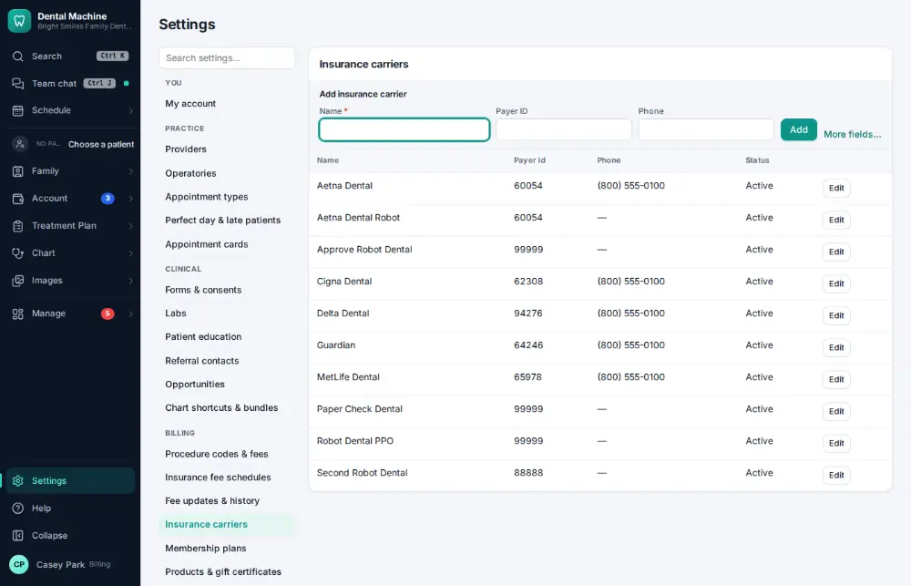
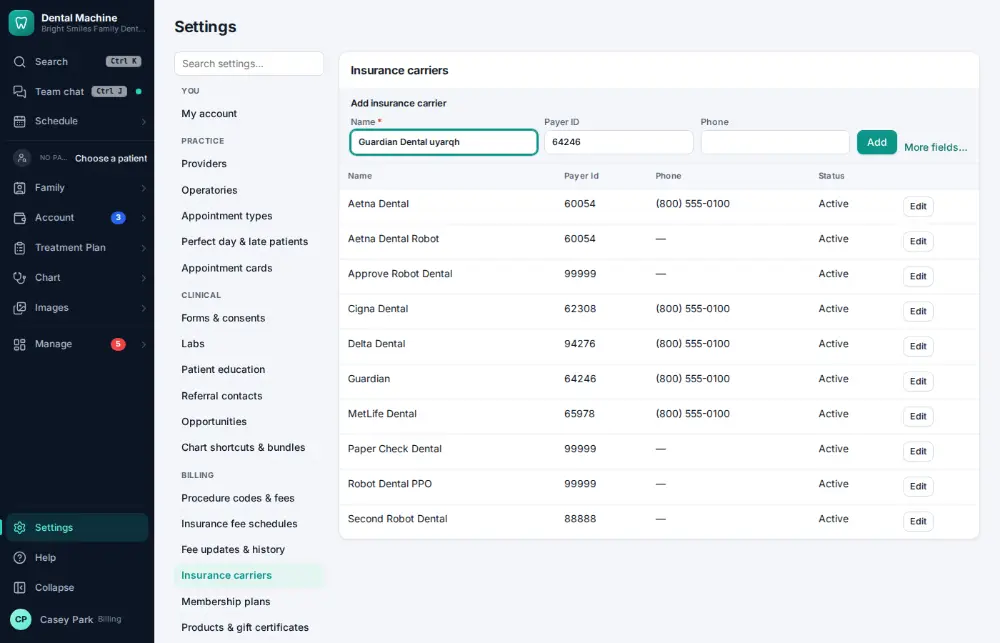
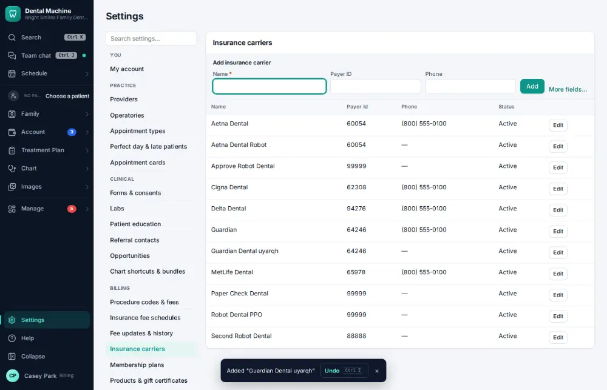

# How do I add an insurance carrier?

**Who:** billing · **Where:** Settings → Insurance carriers · **How often:** About monthly

Add an insurance company with its payer ID so policies and claims can use it.

## Steps

1. Click Settings (bottom of the menu), then "Insurance carriers"

   

2. Type the new carrier: Name, Payer ID (the cursor is already in the add line)

   

3. Press Enter: added (Undo on the toast)  
   Keys: <kbd>Enter</kbd>

   

## Tips

- Undo on the notice removes it again.

## Related

- [How do I update an insurance fee schedule?](A155-update-an-insurance-fee-schedule.md)
- [How do I add a secondary insurance policy?](A091-add-a-secondary-insurance-policy.md)
- [How do I update the office fee schedule?](A154-update-the-office-fee-schedule.md)
- [How do I add a staff member's login?](A156-add-a-staff-member-s-login.md)
- [How do I change a staff member's permissions?](A157-change-a-staff-member-s-permissions.md)

---
[All how-tos](README.md) · Action A139 · screenshots from the robot run of 2026-09-25
