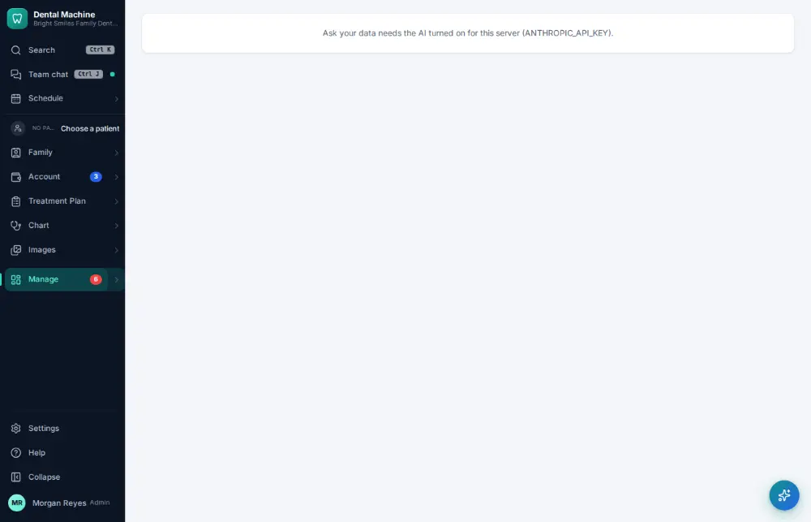

# How do I ask a question about your numbers?

**Who:** office manager · **Where:** Manage ▾ → Ask your data · **How often:** About monthly

Ask questions about your numbers in plain words — “how did production compare with last month?”, “who owes us the most?” — answered from your own records.

## Steps

1. Press Ctrl/⌘K, type "ask your data", Enter  
   Keys: <kbd>Ctrl/⌘ K</kbd> type “ask your data” <kbd>Enter</kbd>

   

## Related

- [How do I build or schedule a custom report?](A158-build-or-schedule-a-custom-report.md)
- [How do I check practice KPIs and metrics?](A105-check-practice-kpis-and-metrics.md)
- [How do I see what pays?](A137-see-what-pays.md)
- [How do I export a report to a spreadsheet?](A142-export-a-report-to-a-spreadsheet.md)
- [How do I review insurance A/R aging?](A124-review-insurance-a-r-aging.md)

---
[All how-tos](README.md) · Action A140 · screenshots from the robot run of 2026-09-25
