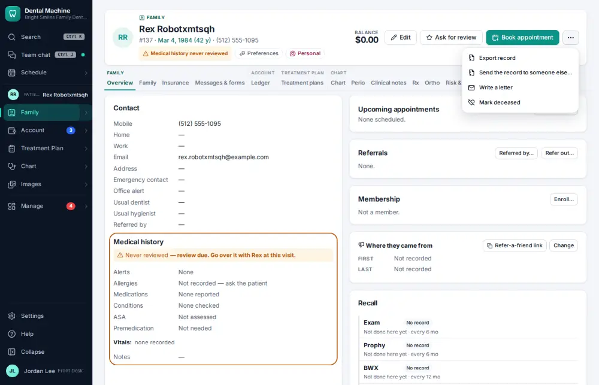
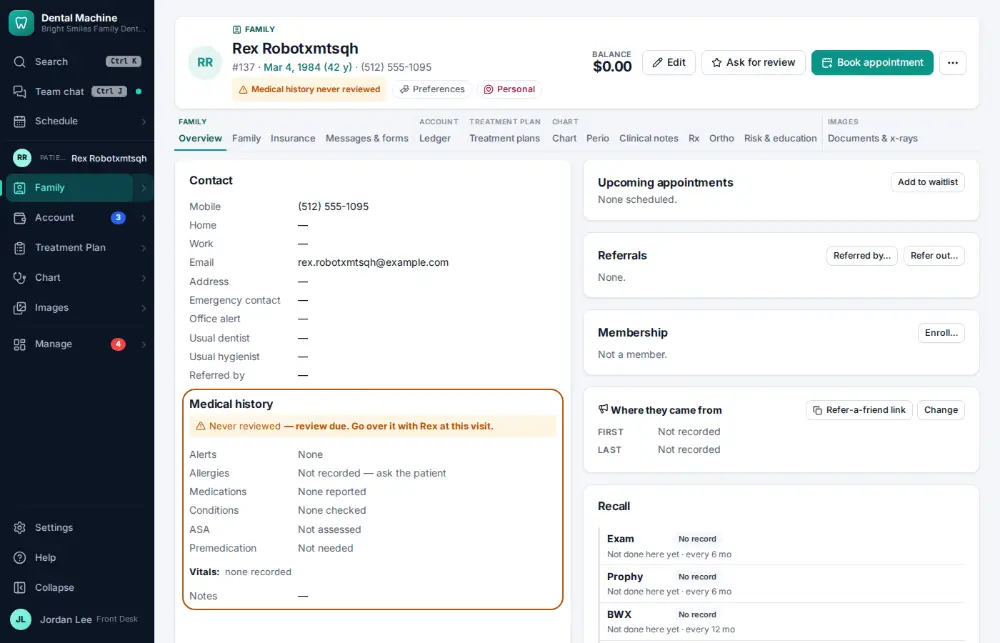

# How do I give a patient a copy of their record?

**Who:** front desk · **Where:** Chart header → ⋯ (More) → Export record · **How often:** About monthly

Patients have the right to a copy of their record. Export record downloads everything as one ZIP: a summary PDF, the data, the images and the documents.

## Where to start

## Steps

1. Click ⋯ (More) in the chart header

   

2. Click "Export record": the summary PDF, data, images and documents download as one ZIP

   

## Tips

- Exports are recorded in the audit log.
- To send the record to someone else (another dentist, a lawyer), use “Send the record to someone else…” on the same menu — it is recorded as a disclosure ([A175](A175-record-a-hipaa-disclosure.md)).

## Related

- [How do I record a HIPAA disclosure?](A175-record-a-hipaa-disclosure.md)
- [How do I look up who changed something?](A160-look-up-who-changed-something.md)
- [How do I log a sterilizer spore test?](A132-log-a-sterilizer-spore-test.md)
- [How do I file an office document?](A153-file-an-office-document.md)
- [How do I check that backups ran?](A159-check-that-backups-ran.md)

---
[All how-tos](README.md) · Action A141 · screenshots from the robot run of 2026-09-25
