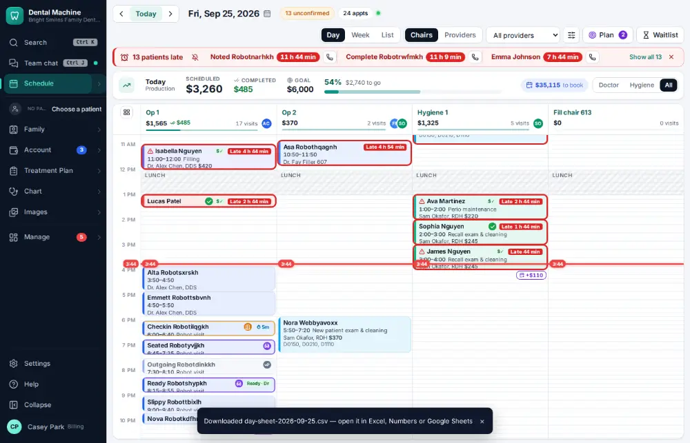

# How do I export a report to a spreadsheet?

**Who:** office manager, billing · **Where:** Command bar “export day sheet”, or any report → ⬇ CSV · **How often:** About monthly

Reports download as a spreadsheet (CSV, which opens in Excel or Google Sheets). From the command bar, “export” and the report’s name downloads it straight away; on any report table, the ⬇ CSV button does the same.

## Steps

1. Press Ctrl/⌘K, type "export day sheet", Enter: today’s day sheet downloads as a spreadsheet  
   Keys: <kbd>Ctrl/⌘ K</kbd> type “export day sheet” <kbd>Enter</kbd>

   

## Tips

- On the production report, E exports and P prints.

## Related

- [How do I check the day sheet at the end of the day?](A085-check-the-day-sheet-at-the-end-of-the-day.md)
- [How do I build or schedule a custom report?](A158-build-or-schedule-a-custom-report.md)
- [How do I see what pays?](A137-see-what-pays.md)
- [How do I ask a question about your numbers?](A140-ask-a-question-about-your-numbers.md)
- [How do I review insurance A/R aging?](A124-review-insurance-a-r-aging.md)

---
[All how-tos](README.md) · Action A142 · screenshots from the robot run of 2026-09-25
