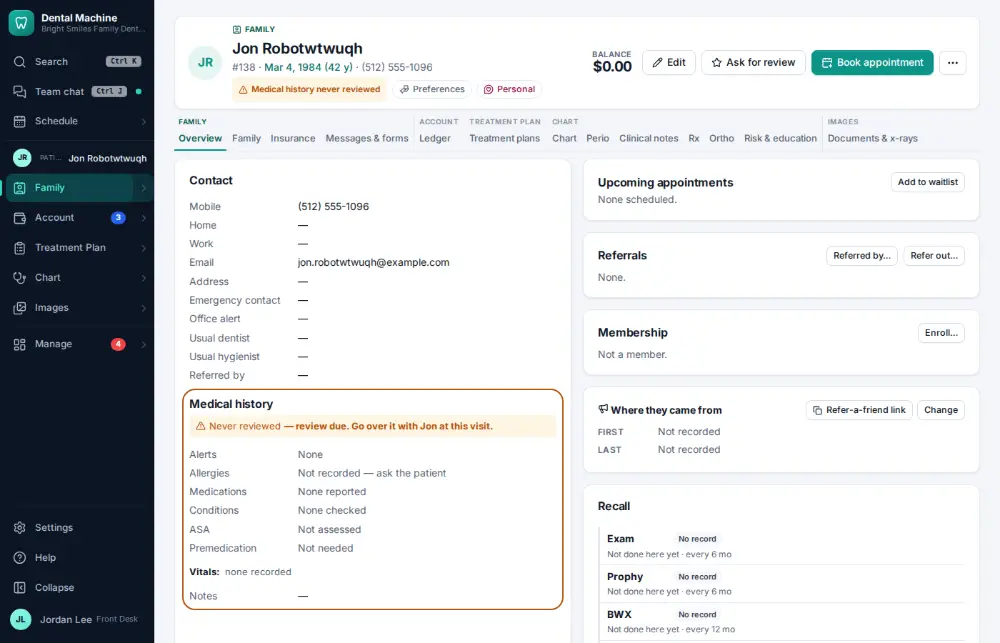
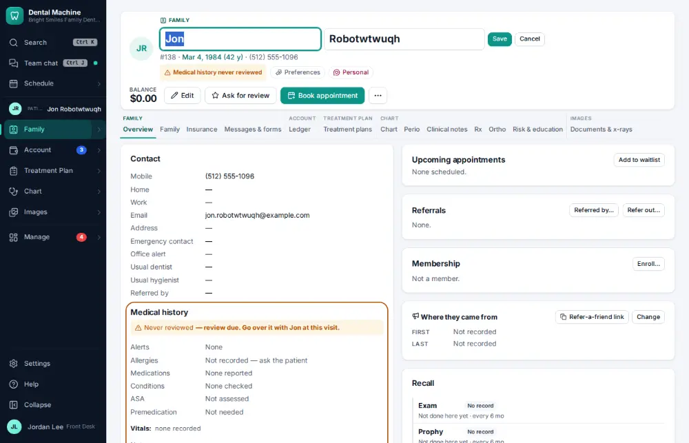
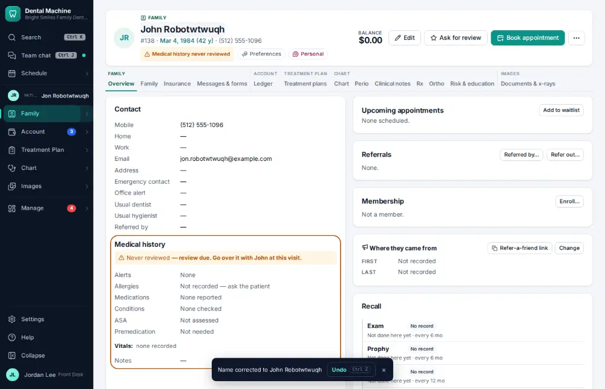

# How do I correct a patient's name or date of birth?

**Who:** front desk · **Where:** Chart header → the patient’s name (or Edit for the birth date) · **How often:** About monthly

Click the name on the chart header to correct it in place. The chart history keeps the old name.

## Where to start

## Steps

1. Click the name on the chart header: first and last name open for correcting (the first name is selected)

   

2. Type the correct spelling and press Enter: saved (Undo shows; the chart history keeps the old name)  
   Keys: <kbd>Enter</kbd>

   

## Tips

- Undo on the notice puts the old value back.
- The birth date is changed with Edit on the chart header.

## If something goes wrong

- **“Name cannot be blank”** — Type the name.
- **“dob must be a real date of birth…”** — Check the date; it can’t be in the future.

## Related

- [How do I update a phone number or email?](A043-update-a-phone-number-or-email.md)
- [How do I merge duplicate patient charts?](A121-merge-duplicate-patient-charts.md)
- [How do I make a patient inactive?](A117-make-a-patient-inactive.md)
- [How do I add a family member to a household?](A090-add-a-family-member-to-a-household.md)
- [How do I record who referred a new patient?](A092-record-who-referred-a-new-patient.md)

---
[All how-tos](README.md) · Action A143 · screenshots from the robot run of 2026-09-25
