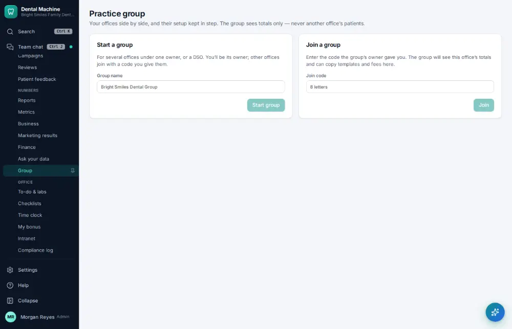

# How do I compare offices?

**Who:** office manager · **Where:** Manage ▾ → Group · **How often:** About monthly

Group shows every office side by side: production, collections, schedule and more.

## Steps

1. In the menu open Manage ▾ and click "Group": every office side by side

   

## Related

- [How do I switch to another office?](A145-switch-to-another-office.md)
- [How do I check practice KPIs and metrics?](A105-check-practice-kpis-and-metrics.md)

---
[All how-tos](README.md) · Action A144 · screenshots from the robot run of 2026-09-25
