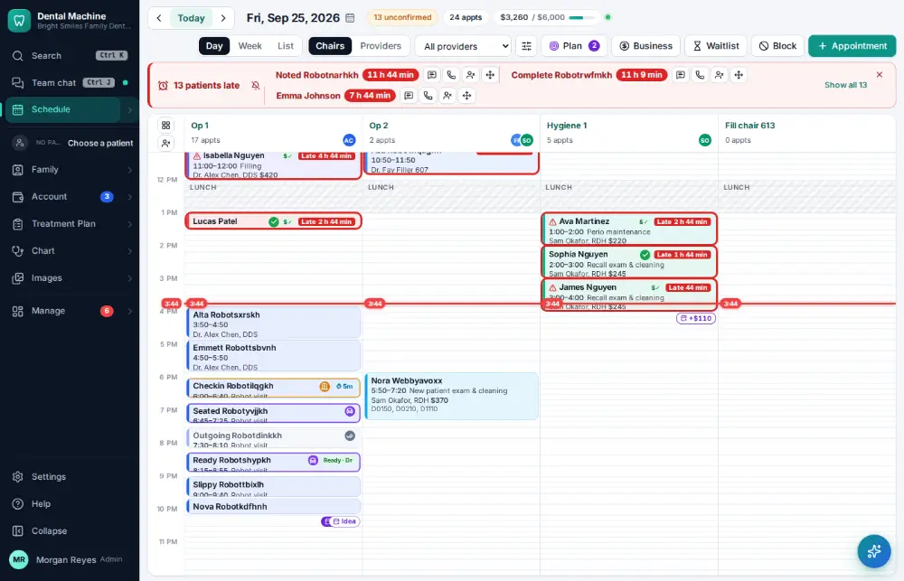
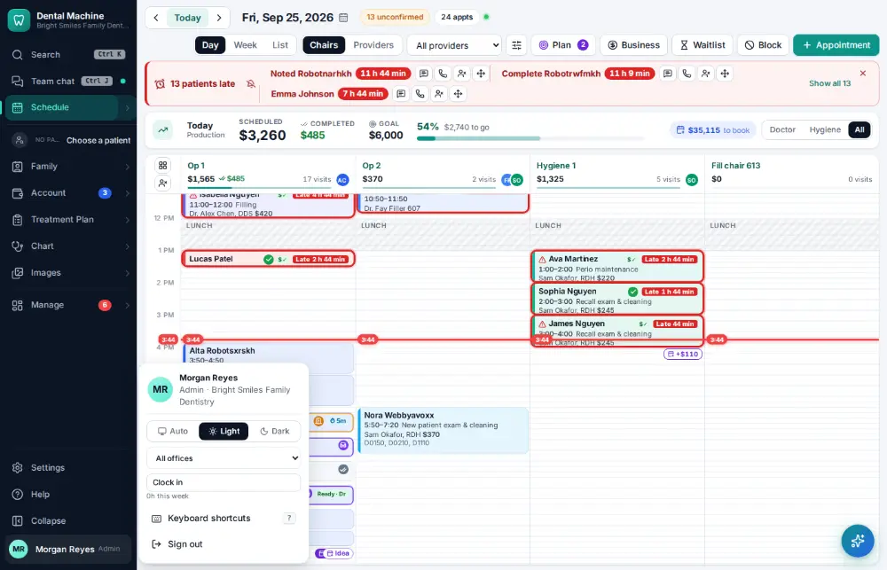

# How do I switch to another office?

**Who:** everyone · **Where:** Your name (bottom of the menu) → the office · **How often:** About monthly

People who work at more than one office switch between them from the menu under their name; every screen then works in that office.

## Where to start

## Steps

1. Click your name (bottom of the menu): the office is at the top of that menu

   

2. Pick "Northside Office": every screen now works in that office

   

## Tips

- Each office’s schedule, deposits and reports are kept separately; Group compares them ([A144](A144-compare-offices.md)).

## Related

- [How do I compare offices?](A144-compare-offices.md)

---
[All how-tos](README.md) · Action A145 · screenshots from the robot run of 2026-09-25
