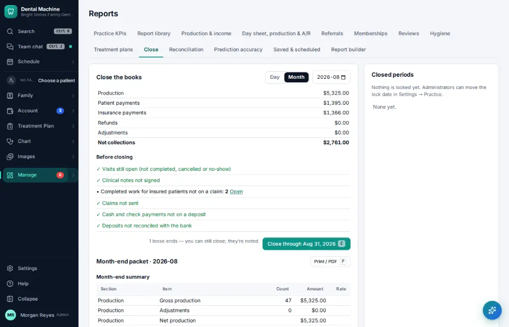
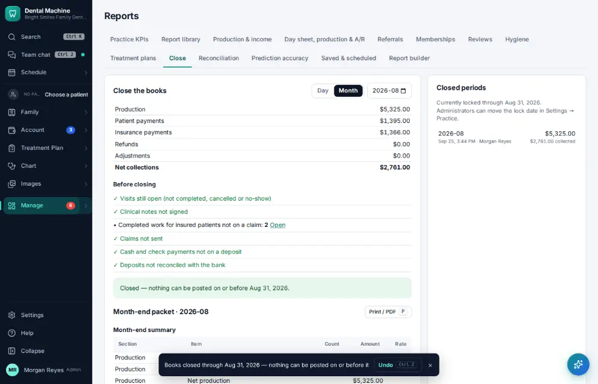

# How do I close the month?

**Who:** office manager · **Where:** Manage ▾ → Reports → Close (command bar “month-end close”) · **How often:** About monthly

Closing the month locks it so nothing can be posted into it by mistake, and gives you the month-end packet to print.

## Steps

1. Press Ctrl/⌘K, type "month-end close", Enter: Close the books  
   Keys: <kbd>Ctrl/⌘ K</kbd> type “month-end close” <kbd>Enter</kbd>

   

2. Press C: the month is closed (Undo shows)  
   Keys: <kbd>C</kbd>

   

## Tips

- On the close screen: M month-end, D end-of-day, C closes, P prints the packet.
- Undo on the notice reopens it straight away.

## Related

- [How do I check the day sheet at the end of the day?](A085-check-the-day-sheet-at-the-end-of-the-day.md)
- [How do I look at the production & collections report?](A104-look-at-the-production-collections-report.md)
- [How do I reconcile the bank and books?](A148-reconcile-the-bank-and-books.md)
- [How do I look at marketing results?](A149-look-at-marketing-results.md)
- [How do I check the hygiene report?](A150-check-the-hygiene-report.md)

---
[All how-tos](README.md) · Action A146 · screenshots from the robot run of 2026-09-25
