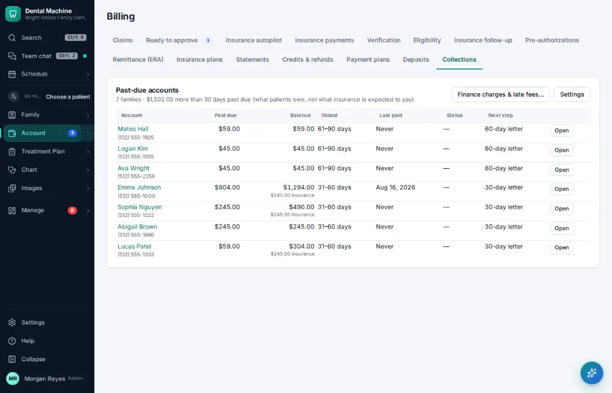
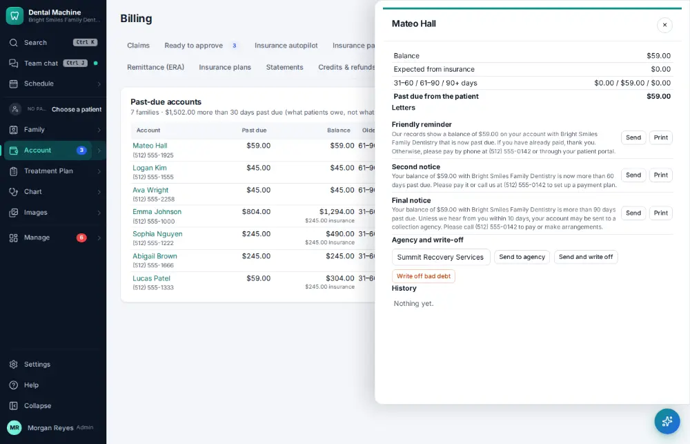
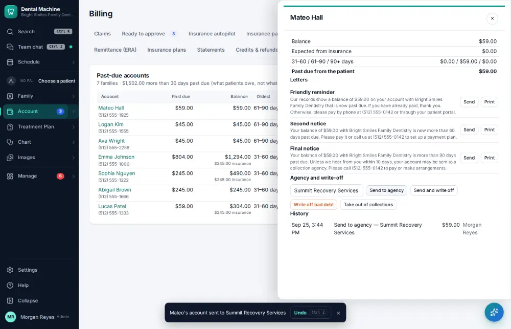

# How do I send an account to collections?

**Who:** billing · **Where:** Account ▾ → Billing & claims → Collections · **How often:** About monthly

Collections lists past-due accounts, oldest first. Open one to see its history and send it to the collection agency.

## Where to start

## Steps

1. Billing → Collections: click "Open" on the oldest past-due account (it opens beside the list)

   

2. Click "Send to agency": sent at once (Undo on the toast takes it back out)

   

## Tips

- Undo on the notice takes it back out of collections.

## Related

- [How do I send patient statements?](A119-send-patient-statements.md)
- [How do I review insurance A/R aging?](A124-review-insurance-a-r-aging.md)
- [How do I reconcile insurance payments with the bank?](A127-reconcile-insurance-payments-with-the-bank.md)
- [How do I sell a product?](A176-sell-a-product.md)
- [How do I refund a credit balance?](A110-refund-a-credit-balance.md)

---
[All how-tos](README.md) · Action A147 · screenshots from the robot run of 2026-09-25
