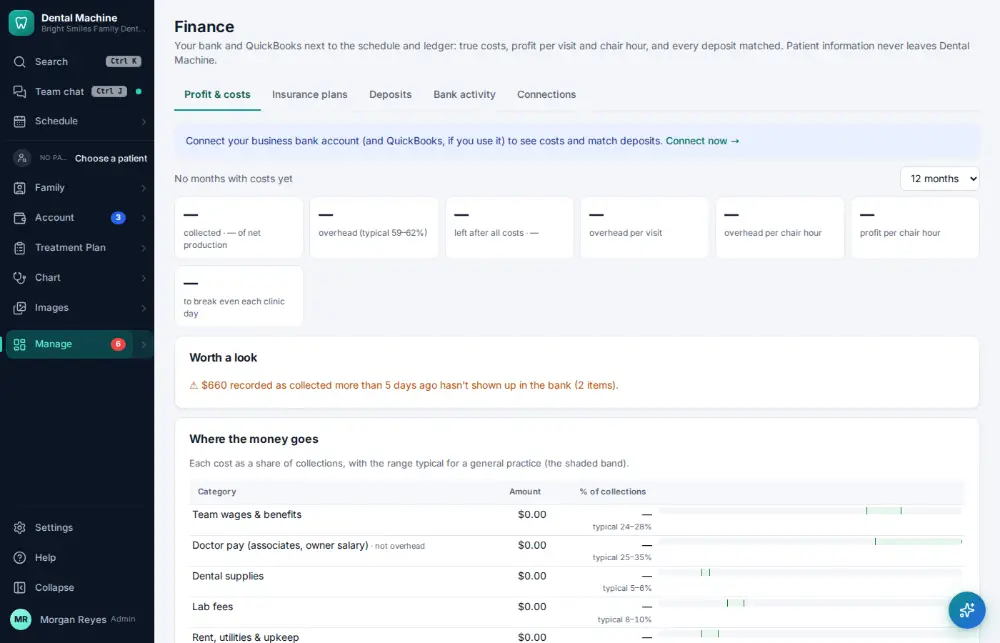

# How do I reconcile the bank and books?

**Who:** office manager · **Where:** Manage ▾ → Finance · **How often:** About monthly

Finance connects the business bank (and QuickBooks) and matches every deposit to what was collected, with overhead by category.

## Steps

1. Press Ctrl/⌘K, type "finance", Enter: bank and books  
   Keys: <kbd>Ctrl/⌘ K</kbd> type “finance” <kbd>Enter</kbd>

   

## Related

- [How do I reconcile insurance payments with the bank?](A127-reconcile-insurance-payments-with-the-bank.md)
- [How do I see what pays?](A137-see-what-pays.md)
- [How do I make the daily bank deposit?](A084-make-the-daily-bank-deposit.md)
- [How do I close the month?](A146-close-the-month.md)
- [How do I look at marketing results?](A149-look-at-marketing-results.md)

---
[All how-tos](README.md) · Action A148 · screenshots from the robot run of 2026-09-25
