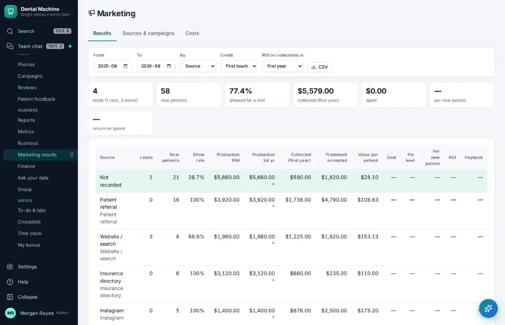

# How do I look at marketing results?

**Who:** office manager · **Where:** Manage ▾ → Marketing results · **How often:** About monthly

Where new patients came from and what they are worth, by source.

## Steps

1. In the menu open Manage ▾ and click "Marketing results"

   

## Tips

- J/K move between rows; Enter shows the patients behind a row.

## Related

- [How do I check where new patients come from?](A152-check-where-new-patients-come-from.md)
- [How do I review phone results?](A128-review-phone-results.md)
- [How do I close the month?](A146-close-the-month.md)
- [How do I reconcile the bank and books?](A148-reconcile-the-bank-and-books.md)
- [How do I check the hygiene report?](A150-check-the-hygiene-report.md)

---
[All how-tos](README.md) · Action A149 · screenshots from the robot run of 2026-09-25
