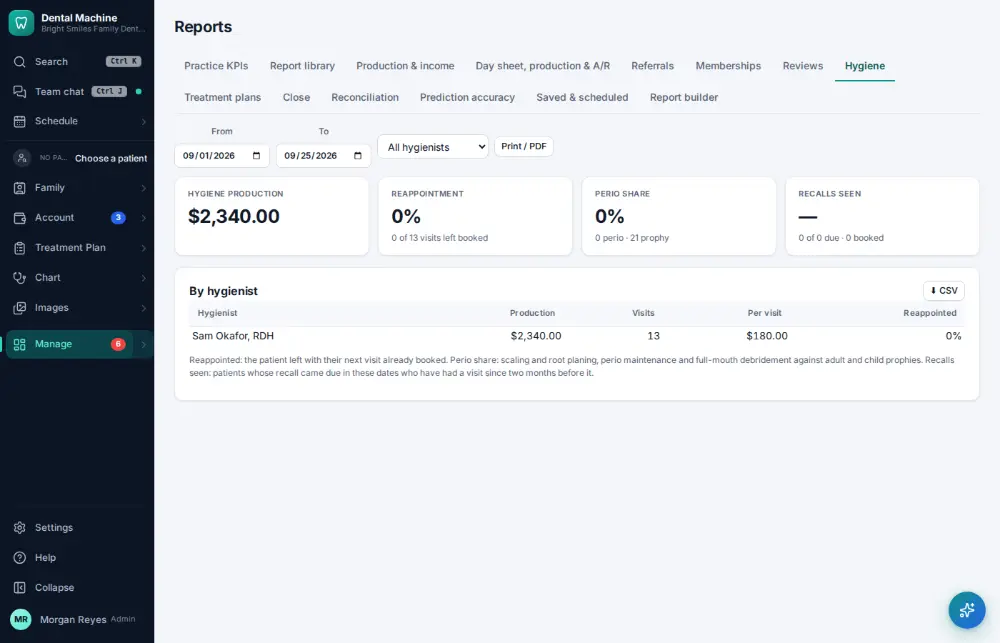

# How do I check the hygiene report?

**Who:** office manager · **Where:** Manage ▾ → Reports → Hygiene · **How often:** About monthly

Hygiene production and how many hygiene patients left with their next visit booked.

## Steps

1. Press Ctrl/⌘K, type "hygiene report", Enter  
   Keys: <kbd>Ctrl/⌘ K</kbd> type “hygiene report” <kbd>Enter</kbd>

   

## Related

- [How do I look at the production & collections report?](A104-look-at-the-production-collections-report.md)
- [How do I check what the recall autopilot did?](A125-check-what-the-recall-autopilot-did.md)
- [How do I close the month?](A146-close-the-month.md)
- [How do I reconcile the bank and books?](A148-reconcile-the-bank-and-books.md)
- [How do I look at marketing results?](A149-look-at-marketing-results.md)

---
[All how-tos](README.md) · Action A150 · screenshots from the robot run of 2026-09-25
